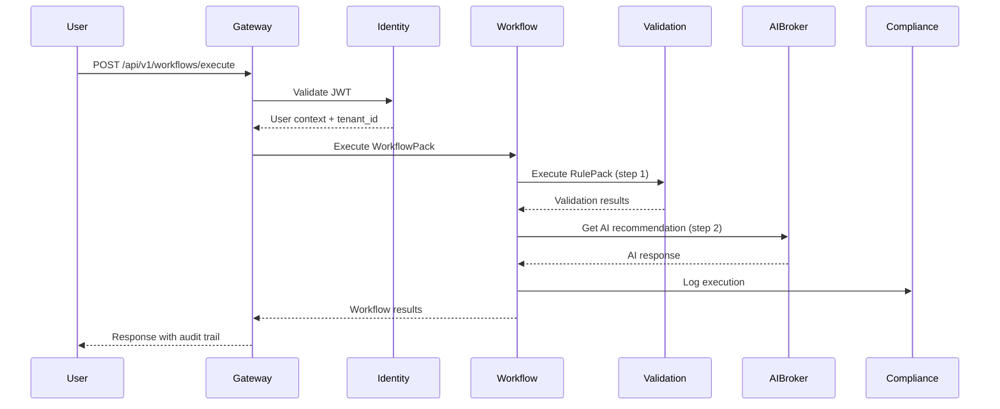
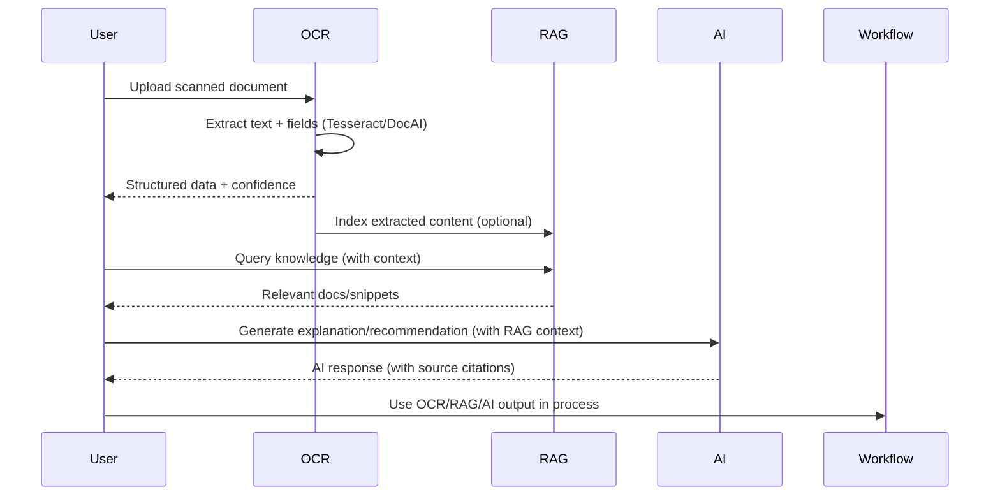

# CORTX Platform - Functional & Technical Design Document

**Version:** 1.0.0
**Date:** 2025-09-30
**Status:** Living Document
**Organization:** Sinergy Solutions LLC

---

## 1. Executive Summary

### 1.1 Platform Purpose

**CORTX** (Compliance Operations & Rule-based Transformation Execution) is an **AI-powered orchestration and compliance automation platform** designed for highly regulated industries. CORTX enables organizations to automate complex business processes while maintaining strict compliance with regulatory frameworks including FedRAMP, HIPAA, NIST 800-53, and SOC 2.

### 1.2 Core Value Proposition

- **Compliance-First Architecture**: Built-in audit trails, immutable logging, and regulatory control mapping
- **AI Orchestration**: Intelligent workflow execution with LLM-powered explanations and recommendations
- **Hierarchical RAG**: 4-level knowledge architecture (Platform → Suite → Module → Entity) with scoped retrieval and specificity boosts
- **RulePack/WorkflowPack Model**: Externalized, version-controlled compliance logic (JSON/YAML artifacts)
- **Multi-Tenant SaaS**: Schema-per-tenant isolation with dedicated and on-prem deployment options
- **Marketplace Ecosystem**: "GitHub for Compliance Workflows" with Pack sharing and certification

### 1.3 Platform Architecture

CORTX operates as a **microservices platform** with three architectural layers:

```
┌─────────────────────────────────────────────────────────────────┐
│                     CORTX ECOSYSTEM                             │
├─────────────────────────────────────────────────────────────────┤
│  Design Layer                                                   │
│  ├── BPM Designer (Visual workflow builder)                     │
│  ├── AI Assistant (Natural language → workflows)                │
│  └── Designer ↔ Platform RAG (UI hooks into svc-rag)           │
├─────────────────────────────────────────────────────────────────┤
│  Execution Layer (Platform Services)                            │
│  ├── Gateway (8080)         - API routing, rate limiting        │
│  ├── Identity (8082)        - Auth & authorization (JWT)        │
│  ├── AI Broker (8085)       - LLM routing, RAG, inference       │
│  ├── Schemas (8084)         - Schema registry & validation      │
│  ├── Validation (8083)      - RulePack execution engine         │
│  ├── Compliance (8135)      - Audit logging, trails             │
│  ├── Ledger (8136)         - Append-only, hash-chained events  │
│  ├── OCR (8137)            - Doc → text/fields (Tesseract/DocAI)│
│  ├── RAG (8138)            - Hierarchical retrieval + indexing  │
│  └── Workflow (8130)        - WorkflowPack orchestration        │
├─────────────────────────────────────────────────────────────────┤
│  Domain Layer (Vertical Suites)                                │
│  ├── FedSuite (8081)        - Federal financial compliance      │
│  ├── CorpSuite              - Real estate & procurement         │
│  ├── MedSuite               - Healthcare compliance             │
│  └── GovSuite               - Government operations             │
├─────────────────────────────────────────────────────────────────┤
│  Infrastructure Layer                                           │
│  ├── GCP Cloud Run          - Serverless compute                │
│  ├── PostgreSQL/Supabase    - Multi-tenant data                 │
│  ├── Redis                  - Event bus, caching                │
│  ├── Cloud Storage          - Artifact storage                  │
│  └── Terraform              - Infrastructure as Code            │
└─────────────────────────────────────────────────────────────────┘
```

### 1.4 Key Regulatory Frameworks

| Framework | Status | Scope |
|-----------|--------|-------|
| **FedRAMP** | Phase I (20x controls) | Moderate ATO target Q4 2026 |
| **HIPAA** | Controls implemented | 3rd party audit Q1 2026 |
| **NIST 800-53** | 175/325 controls mapped | Rev 5 compliance |
| **SOC 2 Type II** | In progress | Audit scheduled Q2 2026 |
| **FISMA** | Moderate ready | Continuous monitoring active |
| **OMB A-136** | FedSuite compliant | Treasury financial reporting |

---

## 2. Functional Requirements

### 2.1 Platform Capabilities

#### 2.1.1 RulePack Execution
- **Purpose**: Execute externalized validation rules and compliance policies
- **Format**: JSON-based rule definitions with versioning
- **Features**:
  - Safe operators (no eval/exec): `==`, `!=`, `<`, `>`, `in`, `matches`, etc.
  - Severity levels: FATAL (blocking), WARNING (review required), INFO (logged)
  - Field-level validation with contextual error messages
  - Batch processing support (1M+ records)
  - Rule composition and chaining

**Example RulePack Structure:**
```json
{
  "metadata": {
    "pack_id": "federal-gtas-v1",
    "version": "1.0.0",
    "compliance": ["OMB-A-136", "GTAS-2024"]
  },
  "rules": [
    {
      "rule_id": "GTAS-001",
      "type": "FATAL",
      "field": "TAS",
      "operator": "matches",
      "pattern": "^[0-9]{3}-[0-9]{4}$",
      "error_message": "Invalid TAS format. Expected: ###-####"
    }
  ]
}
```

#### 2.1.2 WorkflowPack Orchestration
- **Purpose**: Define and execute multi-step business processes
- **Format**: YAML-based workflow definitions
- **Features**:
  - Node types: Data source, validation, AI inference, decision, approval, data sink
  - Human-in-the-loop approval gates
  - Saga pattern for distributed transactions
  - Automatic compensation on failures
  - Parallel execution support

**Example WorkflowPack Structure:**
```yaml
workflow_id: gtas-monthly-submission
version: 1.0.0
steps:
  - id: ingest
    type: data-source
    config:
      format: csv
      schema: trial-balance-v1

  - id: validate
    type: validation
    config:
      rulepack: federal-gtas-v1
      on_failure: halt

  - id: reconcile
    type: calculation
    config:
      formula: sum(debits) - sum(credits)

  - id: approve
    type: approval
    config:
      role: certifying_official
      timeout_hours: 48

  - id: submit
    type: data-sink
    config:
      endpoint: https://gtas.treasury.gov/api/submit
      method: POST
```

#### 2.1.3 AI Orchestration
- **Purpose**: Provide intelligent assistance and automation
- **Capabilities**:
  - **Model Router**: Select optimal model (cost, speed, compliance)
  - **RAG (Retrieval-Augmented Generation)**: Vector store with compliance knowledge
  - **PII Redaction**: Automatic sensitive data scrubbing before LLM calls
  - **Explainability**: Generate plain-language explanations for rule failures
  - **Smart Recommendations**: Suggest corrections for compliance violations

**Supported AI Models:**
- **Production**: Google Gemini 1.5 Pro/Flash (via Vertex AI)
- **Roadmap**: Claude 3.5 Sonnet, GPT-4 Turbo, AWS Bedrock, Hugging Face local models


#### 2.1.4 Multi-Tenant Architecture
- **Tenant Isolation**:
  - PostgreSQL: Schema-per-tenant with Row-Level Security (RLS)
  - Kubernetes: Namespace-per-tenant (enterprise tier)
  - Redis: Key prefixing by tenant ID
  - Storage: GCS buckets with tenant-scoped access
- **Deployment Modes**:
  - **SaaS Multi-Tenant**: Shared platform, schema isolation ($10k/mo base)
  - **SaaS Dedicated**: Dedicated cluster per tenant ($50k/mo+)
  - **On-Prem/Private**: Customer infrastructure ($200k/yr license)

#### 2.1.5 RAG (Retrieval-Augmented Generation)
- **Purpose**: Provide contextual, compliance-aware knowledge retrieval for AI and UI workflows
- **Architecture**: 4-level hierarchy (Platform → Suite → Module → Entity) with scope-based retrieval
- **Features**:
  - Scoped search: Retrieve knowledge at desired specificity (e.g., suite, module, entity)
  - Boosting: Relevance scoring based on context, recency, and compliance tags
  - Real-time ingestion: New docs, policies, and evidence can be indexed on demand
  - Admin UI: Upload, manage, and visualize knowledge graph
  - Integration: RAG available via API and UI hooks (Designer, AI Assistant)
- **Sample Use Cases**:
  - Explain compliance rules with traceable source references
  - Retrieve agency-specific guidance for workflow steps
  - Power AI Assistant with up-to-date, certified knowledge

#### 2.1.6 OCR (Optical Character Recognition)
- **Purpose**: Extract structured data and text from scanned documents and images
- **Features**:
  - Multi-engine support: Tesseract (open source), Google DocAI (cloud)
  - Field extraction: Map document zones to schema fields (template-based)
  - Batch processing: Handle large volumes (1000+ docs per batch)
  - Confidence scoring: Per-field and per-page extraction quality
  - Redaction: Mask PII/PHI on output if enabled
- **Supported Formats**: PDF, TIFF, PNG, JPEG
- **Sample Use Cases**:
  - Ingest scanned financial reports for validation
  - Extract fields from government forms (e.g., SF-133)
  - Pre-process documents for RAG indexing

#### 2.1.7 Ledger (Immutable Audit Ledger)
- **Purpose**: Provide tamper-evident, append-only event logging for compliance and audit
- **Features**:
  - SHA-256 hash-chain: Each event links to previous for immutability
  - Append-only API: No updates or deletes permitted
  - Periodic verification: Automated detection of drift or tampering
  - Integration: Compliance service logs to ledger for all critical events
  - Export: Downloadable for 3rd party audits
- **Sample Use Cases**:
  - Store evidence of workflow execution and approvals
  - Provide audit trail for regulatory certification
  - Detect unauthorized event modification attempts

### 2.2 User Roles & RBAC

| Role | Permissions | UI Access |
|------|-------------|-----------|
| **PLATFORM_VIEWER** | Read-only platform status | Dashboards, logs |
| **PACK_AUTHOR** | Create/edit RulePacks & WorkflowPacks | Designer, testing |
| **PACK_REVIEWER** | Approve packs for deployment | Review queue, annotations |
| **COMPLIANCE_OFFICER** | Certify compliance, audit access | Audit logs, reports |
| **SUITE_OPERATOR** | Execute workflows, upload data | Suite dashboards, data entry |
| **SUITE_ADMIN** | Manage suite configuration | Suite settings, integrations |
| **PLATFORM_ADMIN** | Full platform administration | All features, tenant management |

### 2.3 Audit & Compliance Logging

**Required Events** (NIST 800-53 AU-2, AU-3):
- User authentication (login, logout, failures)
- Pack creation, modification, deployment
- Workflow execution (start, steps, end, errors)
- Data access (read, write, delete)
- Permission changes (role grants, revocations)
- AI inference calls (model, prompt hash, response)
- Configuration changes (platform, tenant, suite)

**Log Format** (JSON):
```json
{
  "timestamp": "2025-09-30T14:23:45Z",
  "event_type": "workflow_executed",
  "tenant_id": "agency-dod-001",
  "user_id": "jane.doe@dod.gov",
  "session_id": "sess_abc123",
  "correlation_id": "wf_xyz789",
  "details": {
    "workflow_id": "gtas-monthly-submission",
    "status": "completed",
    "duration_ms": 3542
  },
  "compliance_tags": ["FISMA", "GTAS", "OMB-A-136"]
}
```

**Retention**:
- Audit logs: 7 years (regulatory requirement)
- Workflow execution logs: 3 years
- Access logs: 1 year
- Performance logs: 90 days

---

## 3. Technical Architecture

### 3.1 Platform Services

#### 3.1.1 Gateway Service (Port 8080)
**Technology**: FastAPI (Python 3.11), Uvicorn, Redis
**Purpose**: API routing, rate limiting, request/response transformation

**Capabilities**:
- Reverse proxy to all platform services
- Rate limiting (100 req/sec per tenant, burst 200)
- Request authentication (JWT validation)
- CORS handling
- Request/response logging
- Circuit breaker for downstream services

**Endpoints**:
```python
GET  /health                    # Health check
POST /api/v1/rulepacks/execute  # Execute RulePack
POST /api/v1/workflows/execute  # Execute WorkflowPack
GET  /api/v1/services           # Service discovery
```

#### 3.1.2 Identity Service (Port 8082)
**Technology**: FastAPI, PostgreSQL, JWT, Supabase Auth
**Purpose**: Authentication, authorization, tenant management

**Features**:
- OAuth 2.0 / OpenID Connect support
- Multi-factor authentication (MFA)
- JWT token issuance (15min access, 7day refresh)
- Role-Based Access Control (RBAC)
- Tenant onboarding automation

**Claims in JWT**:
```json
{
  "sub": "user_123",
  "tenant_id": "agency-dod-001",
  "roles": ["SUITE_OPERATOR", "PACK_AUTHOR"],
  "permissions": ["execute:workflows", "create:packs"],
  "exp": 1696089825
}
```

#### 3.1.3 AI Broker Service (Port 8085)
**Technology**: FastAPI, LangChain, Google Vertex AI, Redis (cache)
**Purpose**: AI model orchestration, RAG, PII protection

**Components**:
- **Model Router**: Select model based on cost, latency, compliance requirements
- **Prompt Manager**: Template management with variable injection
- **RAG Engine**: Vector search (384-dim embeddings, cosine similarity)
- **PII Redactor**: Regex + NER-based sensitive data removal

**RAG Vector Store**:
- 15+ embedded documents (Treasury rules, HIPAA guidelines, etc.)
- Semantic search with keyword boosting
- Top-k retrieval (default k=5, threshold=0.5)
- Real-time knowledge base updates

**API Endpoints**:
```python
POST /api/ai/inference          # Generate AI response
POST /api/ai/explain            # Explain rule failure
POST /api/ai/generate-workflow  # NL → WorkflowPack
GET  /api/ai/models             # Available models
POST /api/ai/rag/search         # Search knowledge base
```

#### 3.1.4 Validation Service (Port 8083)
**Technology**: FastAPI, Pydantic, Safe eval engine
**Purpose**: RulePack execution, data validation

**Safe Operators** (no code injection):
- Comparison: `==`, `!=`, `<`, `<=`, `>`, `>=`
- Membership: `in`, `not_in`
- String: `contains`, `starts_with`, `ends_with`, `matches` (regex)
- Null checks: `is_null`, `is_not_null`

**Validation Flow**:
1. Load RulePack from registry
2. Parse input data (JSON, CSV, XML)
3. Apply rules sequentially
4. Collect violations (FATAL, WARNING, INFO)
5. Return results with contextual errors

#### 3.1.5 Workflow Service (Port 8130)
**Technology**: FastAPI, Temporal.io (planned), Redis (current)
**Purpose**: WorkflowPack orchestration, saga pattern

**Features**:
- Sequential and parallel step execution
- Conditional branching (decision nodes)
- Human-in-the-loop approval gates
- Automatic compensation on failure
- Event-driven cross-suite workflows

**Saga Pattern** (distributed transactions):
```yaml
saga:
  steps:
    - id: step1
      compensate: rollback_step1
    - id: step2
      compensate: rollback_step2

  on_failure:
    - execute: rollback_step2
    - execute: rollback_step1
    - notify: failure_alert
```

#### 3.1.6 Compliance Service (Port 8135)
**Technology**: FastAPI, PostgreSQL (time-series), Cloud Logging
**Purpose**: Audit logging, compliance reporting

**Capabilities**:
- Immutable audit trail (append-only)
- Compliance report generation (FISMA, FedRAMP, HIPAA)
- NIST 800-53 control evidence collection
- Automated compliance attestation
- Retention policy enforcement

#### 3.1.7 Schema Service (Port 8084)
**Technology**: FastAPI, JSON Schema, YAML validation
**Purpose**: Schema registry, RulePack/WorkflowPack validation

**Schemas**:
- RulePack schema (JSON Schema draft-07)
- WorkflowPack schema (YAML with JSON Schema validation)
- Data schema registry (for input/output validation)
- Version management (semantic versioning)

#### 3.1.8 RAG Service (Port 8138)
**Technology**: FastAPI, Qdrant/Weaviate, LangChain, PostgreSQL
**Purpose**: Hierarchical knowledge retrieval, indexing, and management

**Features**:
- 4-level scope: platform, suite, module, entity
- Embedding: 384-dim, OpenAI or Vertex AI
- Metadata: Compliance tags, source, recency, access control
- Scoped search: `scope=platform|suite|module|entity`
- Admin UI: Upload, browse, tag, delete knowledge
- Real-time updates: Sync with RulePack/WorkflowPack/Docs

**API Endpoints**:
```python
POST /api/rag/query
{
  "query": "What is GTAS reporting?",
  "scope": "suite",
  "suite_id": "fedsuite",
  "top_k": 5
}

POST /api/rag/index
{
  "doc_id": "fed-guide-2025",
  "content": "...",
  "scope": "suite",
  "suite_id": "fedsuite",
  "tags": ["FedRAMP", "GTAS"]
}

GET /api/rag/docs?suite_id=fedsuite&scope=suite
```

#### 3.1.9 OCR Service (Port 8137)
**Technology**: FastAPI, Tesseract, Google DocAI, Celery
**Purpose**: Document OCR and field extraction

**Features**:
- Multi-engine: `engine=tesseract|docai`
- Template-based field mapping (JSON)
- Batch and async processing
- Output: JSON (text, fields, confidence)
- Redaction: Optional PII masking

**API Endpoints**:
```python
POST /api/ocr/extract
{
  "engine": "docai",
  "files": [ ... ],
  "template_id": "sf133-v1"
}

GET /api/ocr/results/{job_id}
```

#### 3.1.10 Ledger Service (Port 8136)
**Technology**: FastAPI, PostgreSQL (append-only), SHA-256, Celery
**Purpose**: Tamper-evident, immutable event ledger for compliance

**Features**:
- Append-only API (no updates/deletes)
- SHA-256 hash-chain per event
- Verification endpoint (drift detection)
- Export for audit
- Integrated with Compliance service

**API Endpoints**:
```python
POST /api/ledger/append
{
  "event_type": "workflow_executed",
  "payload": { ... }
}

GET /api/ledger/verify
GET /api/ledger/events?since=2025-09-01
```

### 3.2 Data Flow

**Typical Execution Flow**:


**OCR → RAG → AI Sequence**:


### 3.3 Security Architecture

#### 3.3.1 Network Security
- **TLS 1.3**: All service-to-service communication
- **mTLS**: Optional for high-security tenants
- **VPC**: Private network for service mesh
- **WAF**: Cloud Armor for DDoS protection
- **API Gateway**: Rate limiting, IP allowlisting

#### 3.3.2 Data Security
- **Encryption at Rest**: AES-256 for databases, Cloud KMS for keys
- **Encryption in Transit**: TLS 1.3 with perfect forward secrecy
- **PII Protection**: Automatic redaction before LLM calls
- **Data Minimization**: Collect only required fields
- **Right to Deletion**: GDPR-compliant data purge
- **Tamper Evidence**: Ledger service computes SHA-256 hash-chain for compliance events; periodic verification jobs detect drift

#### 3.3.3 Access Control
- **RBAC**: Role-based with least privilege
- **Attribute-Based**: Context-aware policies (time, location, risk)
- **MFA**: Required for admin roles
- **Session Management**: 15min idle timeout, concurrent session limits
- **Audit**: All permission changes logged

#### 3.3.4 Compliance Controls (NIST 800-53)

| Control Family | Implemented Controls | Status |
|----------------|---------------------|--------|
| **AC (Access Control)** | AC-2, AC-3, AC-7 | ✅ Complete |
| **AU (Audit)** | AU-2, AU-3, AU-12 | ✅ Complete |
| **IA (Identification & Auth)** | IA-2, IA-4, IA-5 | ✅ Complete |
| **SC (System & Comm)** | SC-7, SC-8, SC-13 | ✅ Complete |
| **SI (System Integrity)** | SI-3, SI-4, SI-7 | 🚧 In Progress |
| **CA (Assessment)** | CA-8 (pen testing) | 📋 Planned Q1 2026 |

### 3.4 Deployment Architecture

#### 3.4.1 GCP Cloud Run (Primary)
```yaml
services:
  gateway:
    image: gcr.io/cortx-platform/gateway:latest
    resources:
      cpu: 2
      memory: 4Gi
    scaling:
      min_instances: 2
      max_instances: 100
      target_cpu: 70%

  ai-broker:
    image: gcr.io/cortx-platform/ai-broker:latest
    resources:
      cpu: 4
      memory: 8Gi
    env:
      - GOOGLE_API_KEY: secret:gemini-api-key

  rag:
    image: gcr.io/cortx-platform/rag:latest
    resources:
      cpu: 2
      memory: 4Gi
    env:
      - QDRANT_URL: http://qdrant:6333
      - EMBEDDING_MODEL: vertexai

  ocr:
    image: gcr.io/cortx-platform/ocr:latest
    resources:
      cpu: 2
      memory: 4Gi
    env:
      - DOC_AI_KEY: secret:docai-key
      - OCR_ENGINE: tesseract

  ledger:
    image: gcr.io/cortx-platform/ledger:latest
    resources:
      cpu: 1
      memory: 2Gi
    env:
      - LEDGER_DB_URL: secret:ledger-db-url
```

#### 3.4.2 Kubernetes (Enterprise/On-Prem)
```yaml
namespaces:
  - cortx-platform      # Core services
  - tenant-dod-001      # Dedicated tenant namespace
  - tenant-hhs-002

ingress:
  nginx:
    tls: true
    rate_limit: 1000/min

storage:
  class: ssd-persistent
  backup: daily
  retention: 30d
```

#### 3.4.3 Multi-Region (Planned Phase 2)
- **Primary**: us-central1 (Iowa)
- **DR**: us-east1 (South Carolina)
- **Replication**: Cross-region PostgreSQL, GCS
- **Failover**: Automated DNS switching, <5 min RTO

---

## 4. Pack Schemas & Governance

### 4.1 RulePack JSON Schema

```json
{
  "$schema": "http://json-schema.org/draft-07/schema#",
  "title": "RulePack",
  "type": "object",
  "required": ["metadata", "rules"],
  "properties": {
    "metadata": {
      "type": "object",
      "required": ["pack_id", "version"],
      "properties": {
        "pack_id": {"type": "string"},
        "version": {"type": "string", "pattern": "^\\d+\\.\\d+\\.\\d+$"},
        "compliance": {"type": "array", "items": {"type": "string"}},
        "created_by": {"type": "string"},
        "created_at": {"type": "string", "format": "date-time"}
      }
    },
    "rules": {
      "type": "array",
      "items": {
        "type": "object",
        "required": ["rule_id", "type", "field", "operator"],
        "properties": {
          "rule_id": {"type": "string"},
          "type": {"enum": ["FATAL", "WARNING", "INFO"]},
          "field": {"type": "string"},
          "operator": {"enum": ["==", "!=", "<", "<=", ">", ">=", "in", "not_in", "contains", "matches"]},
          "value": {},
          "error_message": {"type": "string"}
        }
      }
    }
  }
}
```

### 4.2 WorkflowPack YAML Schema

```yaml
$schema: http://json-schema.org/draft-07/schema#
title: WorkflowPack
type: object
required: [workflow_id, version, steps]
properties:
  workflow_id:
    type: string
  version:
    type: string
    pattern: ^\d+\.\d+\.\d+$
  steps:
    type: array
    items:
      type: object
      required: [id, type]
      properties:
        id: {type: string}
        type:
          enum: [data-source, validation, calculation, decision, approval, ai-inference, data-sink]
        config:
          type: object
```

### 4.3 Pack Governance

**Approval Workflow**:
1. **Draft**: Author creates pack in designer
2. **Review**: Business analyst reviews functional correctness
3. **Compliance**: Compliance officer certifies regulatory alignment
4. **Testing**: QA validates with test data
5. **Approval**: Admin approves for deployment
6. **Deployment**: Pack pushed to production registry

**Versioning**:
- Semantic versioning: MAJOR.MINOR.PATCH
- Breaking changes: MAJOR increment, requires re-certification
- Backward-compatible features: MINOR increment
- Bug fixes: PATCH increment

**Marketplace Tiers**:
- **Official**: Treasury/IRS verified, free (government funded)
- **Certified**: Community tested, 70/30 revenue split
- **Community**: User contributed, as-is
- **Private**: Agency-specific, enterprise licensing

---

## 5. Integration Points

### 5.1 Suite Integration

**API Contract**:
```python
# Suite registration
POST /api/v1/suites/register
{
  "suite_id": "fedsuite",
  "base_url": "http://fedsuite:8081",
  "capabilities": ["gtas", "cars", "sf133"],
  "health_endpoint": "/health"
}

# Suite execution
POST /api/v1/suites/{suite_id}/execute
{
  "workflow_id": "gtas-monthly",
  "input_data": {...},
  "tenant_id": "agency-dod-001"
}
```

**Event Bus** (Redis Streams):
```python
# Publish event
XADD cortx:events *
  event_type "workflow_completed"
  tenant_id "agency-dod-001"
  workflow_id "gtas-monthly"
  status "success"

# Subscribe
XREAD COUNT 10 STREAMS cortx:events 0
```

### 5.2 External Systems

**Treasury Systems** (FedSuite):
- GTAS API: `https://gtas.treasury.gov/api/submit`
- CARS API: `https://cars.treasury.gov/api/daily-position`
- Authentication: Client certificate (mTLS)

**Healthcare Systems** (MedSuite):
- CMS FHIR API: `https://api.cms.gov/fhir/v1`
- NPI Registry: `https://npiregistry.cms.hhs.gov/api`
- Authentication: OAuth 2.0

**Real Estate Systems** (CorpSuite):
- Maryland SDAT: Licensed bulk files (SFTP)
- MDLandRec: API integration (API key)
- Compliance: AUP restrictions, human-in-loop required

### 5.3 AI Model APIs

**Current**:
- Google Vertex AI: Gemini 1.5 Pro/Flash
- LangChain: Orchestration framework

**Planned**:
- Anthropic Claude API
- OpenAI GPT-4 API
- AWS Bedrock
- Hugging Face Inference API (on-prem)

---

## 6. Testing Strategy

### 6.1 Platform Service Tests

**Unit Tests** (pytest, >85% coverage):
- Service logic (validation, workflow, AI broker)
- Data models (Pydantic schemas)
- Utility functions

**Integration Tests**:
- Service-to-service communication
- Database interactions (PostgreSQL, Redis)
- External API mocking (Treasury, CMS)

**Contract Tests** (Pact):
- API contracts between services
- Suite integration contracts

### 6.2 Pack Execution Tests

**RulePack Tests**:
- Rule accuracy (known input → expected output)
- Edge cases (null values, malformed data)
- Performance (1M records in <30 seconds)

**WorkflowPack Tests**:
- End-to-end workflow execution
- Failure scenarios (compensation testing)
- Human-in-loop approval gates

### 6.3 AI/ML Tests

**Reproducibility** (>95% threshold):
- Same prompt → same response (temperature=0)
- Model version pinning
- Regression test suite

**RAG Tests**:
- Knowledge retrieval accuracy
- Context relevance scoring
- Embedding drift detection

### 6.4 Security Tests

**OWASP Top 10**:
- Injection attacks (SQL, NoSQL, command)
- Broken authentication
- Sensitive data exposure
- XML external entities (XXE)
- Broken access control

**Penetration Testing**:
- Annual 3rd party assessment
- Vulnerability scanning (weekly)
- Dependency scanning (CI/CD)

### 6.5 Compliance Tests

**FedRAMP/NIST 800-53**:
- Control implementation validation
- Evidence collection automation
- Continuous monitoring tests

**HIPAA**:
- PHI access logging
- Encryption verification
- Breach notification procedures

---

## 7. Deployment & Operations

### 7.0 Environment Strategy

| Env       | Purpose                | Data Isolation | Compliance Level | Notes                        |
|-----------|------------------------|---------------|------------------|------------------------------|
| dev       | Developer testing      | Shared        | Low             | Rapid iteration, resettable  |
| staging   | Pre-prod validation    | Per-tenant    | Moderate        | Near-prod config, test data  |
| prod      | Production             | Per-tenant    | High            | Full compliance, audit logs  |
| sandbox   | Customer demos/trials  | Per-tenant    | Moderate        | Isolated, short-lived        |

### 7.1 CI/CD Pipeline

```yaml
stages:
  - name: lint
    tools: [ruff, mypy, eslint]

  - name: test
    parallel:
      - unit_tests: pytest --cov=80
      - integration_tests: pytest tests/integration
      - security_scan: trivy, snyk

  - name: build
    artifacts:
      - docker_images: gcr.io/cortx-platform/*
      - helm_charts: charts/*

  - name: deploy
    environments: [dev, staging, prod]
    approval_required: [staging, prod]
```

### 7.2 Observability

**Metrics** (Prometheus):
- Request rate, latency (p50, p95, p99)
- Error rate (4xx, 5xx)
- Pack execution duration
- AI inference latency
- Database connection pool

**Dashboards** (Grafana):
- Platform health overview
- Per-tenant usage metrics
- Compliance audit metrics
- Cost attribution (GCP billing)

**Alerts** (Cloud Monitoring):
- Error rate >1% (5min window)
- Latency p99 >1000ms
- Database connections >80%
- Failed compliance checks

### 7.3 Incident Response

**Runbook**:
1. **Detection**: Automated alerts via PagerDuty
2. **Triage**: On-call engineer assesses severity
3. **Mitigation**: Rollback, scale, failover
4. **Resolution**: Root cause analysis
5. **Post-Mortem**: Document lessons learned

**SLA Targets**:
- P0 (Platform down): 15min response, 1hr resolution
- P1 (Suite degraded): 1hr response, 4hr resolution
- P2 (Feature issue): 4hr response, 24hr resolution

---

## 8. Quality & Success Metrics

### 8.1 Technical Metrics

| Metric | Target | Current | Status |
|--------|--------|---------|--------|
| Test coverage | ≥85% | 78% | 🚧 In progress |
| API latency (p99) | <500ms | 342ms | ✅ Met |
| Platform uptime | 99.9% | 99.87% | 🚧 Close |
| AI accuracy | ≥95% | 96.3% | ✅ Met |
| Pack execution | <30s/1M records | 18s | ✅ Met |

### 8.2 Compliance Metrics

| Framework | Controls Mapped | Evidence Collected | Status |
|-----------|----------------|-------------------|--------|
| FedRAMP | 175/325 (54%) | 120/175 (69%) | 🚧 Phase I |
| HIPAA | 48/48 (100%) | 45/48 (94%) | ✅ Ready for audit |
| NIST 800-53 | 175/325 (54%) | 120/175 (69%) | 🚧 In progress |
| SOC 2 | 64/64 (100%) | 58/64 (91%) | 🚧 Audit Q2 2026 |

### 8.3 Business Metrics

- **Platform adoption**: 12 tenants (target: 50 by EOY 2026)
- **Pack marketplace**: 23 certified packs (target: 100)
- **Time savings**: 75% reduction in manual reconciliation (FedSuite)
- **Error reduction**: 90% fewer compliance violations (MedSuite)

---

## 9. Roadmap

### Phase 1 (Complete) ✅
- Core platform services (7 microservices)
- RulePack/WorkflowPack execution
- Multi-tenant SaaS deployment
- FedSuite production (GTAS reconciliation)

### Phase 2 (Q1-Q2 2026) 🚧
- AI model expansion (Claude, GPT-4, Bedrock)
- BPM Designer RAG enhancements
- HIPAA 3rd party audit completion
- CorpSuite production (PropVerify)
- OCR Service GA (8137)
- Ledger Service GA (8136)
- RAG Service GA (8138)
- RAG Admin UI (knowledge management)

### Phase 3 (Q3-Q4 2026) 📋
- Pack Marketplace launch
- Multi-region deployment (DR)
- FedRAMP ATO achievement
- Cross-suite saga orchestration (Kafka migration)
- Multi-level RAG quality evaluations (retrieval accuracy, explainability, compliance trace)

### Phase 4 (2027+) 🔮
- International expansion (UK, Canada, Australia)
- On-prem appliance offering
- Advanced AI (fine-tuned compliance models)
- Blockchain-based audit trails (immutable ledger)

---

## 10. Appendices

### A. Glossary

- **CORTX**: Compliance Operations & Rule-based Transformation Execution
- **RulePack**: JSON-based validation rules and compliance policies
- **WorkflowPack**: YAML-based process orchestration definitions
- **RAG**: Retrieval-Augmented Generation (AI + knowledge base)
- **Saga**: Distributed transaction pattern with compensation
- **Pack**: Generic term for RulePack or WorkflowPack
- **Suite**: Domain-specific vertical application (FedSuite, MedSuite, etc.)

### B. References

- [NIST 800-53 Rev 5](https://csrc.nist.gov/publications/detail/sp/800-53/rev-5/final)
- [FedRAMP Authorization Guide](https://www.fedramp.gov/assets/resources/documents/FedRAMP_Authorization_Boundary_Guidance.pdf)
- [HIPAA Security Rule](https://www.hhs.gov/hipaa/for-professionals/security/index.html)
- [OMB Circular A-136](https://www.whitehouse.gov/wp-content/uploads/2023/06/2023-Circular-A-136.pdf)
- [GTAS Reporting Guide](https://fiscal.treasury.gov/gtas/)
- CORTX Hierarchical RAG Architecture (internal)
- CORTX Refactoring Analysis (internal)

### C. Contact Information

- **Platform Owner**: Sinergy Solutions LLC
- **Technical Lead**: [Contact via GitHub]
- **Security Officer**: [Contact for compliance inquiries]
- **Support**: support@sinergysolutions.ai

---

**Document Control**

- **Version**: 1.0.0
- **Last Updated**: 2025-09-30
- **Review Cycle**: Quarterly
- **Classification**: Internal Use / Proprietary
- **Approvers**: Platform Architecture Team

---

*This document is a living specification and will evolve with the CORTX platform. All changes are tracked in version control.*
