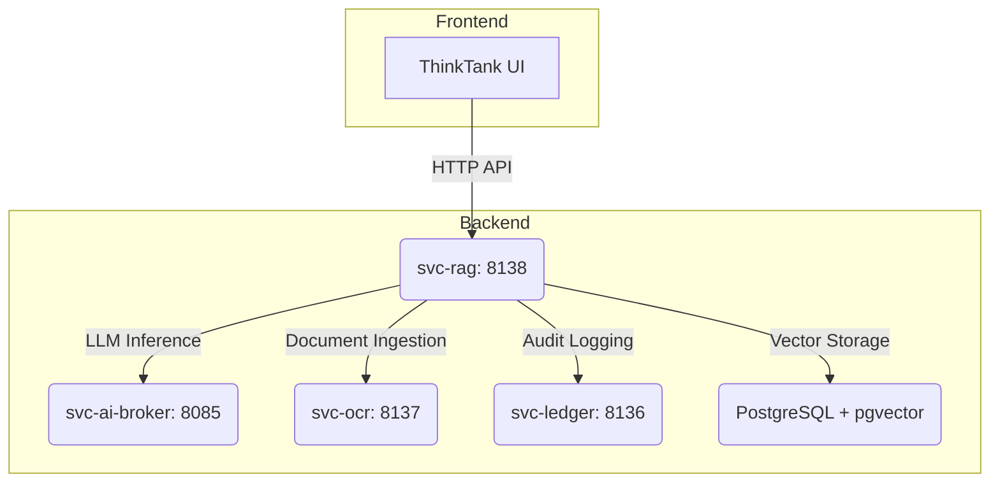

# RAG Service (ThinkTank) Architecture

**Version**: 1.0
**Status**: Implemented
**Owner**: AI Platform Team
**Contact**: <ai-platform@sinergysolutions.ai>

---

## 1. Vision & Purpose

**ThinkTank** is the centralized RAG (Retrieval-Augmented Generation) Service and AI Chat Assistant that serves as the "brain" of the CORTX Platform. It provides adaptive, context-aware AI guidance across all Suites and Modules, grounding its responses in a curated and hierarchical knowledge base.

### Core Principles

1. **Policy-First Guidance**: Every response prioritizes compliance, security, and regulatory requirements.
2. **Context-Adaptive**: Automatically adjusts knowledge retrieval based on the user's current Suite, Module, and Entity context.
3. **Hierarchical Knowledge**: Utilizes a 4-level knowledge hierarchy (Platform → Suite → Module → Entity/Tenant) to provide the most relevant information.
4. **Centralized Intelligence**: Acts as the single source of truth for AI capabilities across all applications.
5. **Explainability**: Cites the sources used to generate a response, providing transparency and trust.

---

## 2. System Architecture

ThinkTank consists of a frontend UI component and a backend RAG service (`svc-rag`), which integrates with other platform services.

### System Components Diagram



### Data Flow

1. A user submits a query through the **ThinkTank UI**.
2. The UI sends the query to the **`svc-rag` API**, including the user's context (Suite, Module, etc.).
3. `svc-rag` performs **Hierarchical Retrieval** from the PostgreSQL/pgvector database, searching for relevant document chunks.
4. The retrieved chunks and the original query are combined into a prompt that is sent to **`svc-ai-broker`** for LLM generation (e.g., Gemini, Claude).
5. The LLM generates a response grounded in the provided context.
6. The entire transaction (query, sources, response) is logged to **`svc-ledger`** for a complete audit trail.
7. The final response, including citations, is returned to the user.

---

## 3. Hierarchical Knowledge Base

The power of ThinkTank comes from its 4-level hierarchical knowledge architecture, which allows it to provide highly contextual answers.

### Knowledge Hierarchy

| Level | Scope | Description | Examples |
| :--- | :--- | :--- | :--- |
| **1. Platform** | Global | Universal knowledge applicable to all suites and modules. | NIST 800-53, HIPAA, CORTX Platform docs. |
| **2. Suite** | Domain-Specific | Knowledge for a specific vertical like federal or healthcare. | FedSuite: OMB Circulars, GTAS Guide. MedSuite: CMS Guidelines. |
| **3. Module** | Module-Specific | Technical knowledge for a specific module. | DataFlow: Oracle table schemas. PropVerify: SDAT API docs. |
| **4. Entity** | Tenant-Specific | Private knowledge for a single organization. | Agency-specific accounting policies, custom workflows. |

### Cascading Retrieval Strategy

When a query is received, the retrieval process "cascades" through the hierarchy, starting from the most specific level and moving outward. This ensures the most relevant context is prioritized.

1. **Search Order**: Entity → Module → Suite → Platform.
2. **Context Boosting**: A scoring boost is applied to chunks from more specific levels (e.g., Entity results are boosted more than Platform results).
3. **Smart Expansion**: The search expands to higher levels if insufficient results are found at the lower levels.

### Vector Store Schema

The knowledge base is stored in a PostgreSQL database with the `pgvector` extension.

```sql
-- Stores document metadata and hierarchy
CREATE TABLE rag.documents (
    id UUID PRIMARY KEY,
    tenant_id TEXT NOT NULL,
    level TEXT NOT NULL CHECK (level IN ('platform','suite','module','entity')),
    suite_id TEXT,
    module_id TEXT,
    title TEXT,
    source_uri TEXT,
    metadata JSONB
);

-- Stores text chunks and their vector embeddings
CREATE TABLE rag.chunks (
    id UUID PRIMARY KEY,
    document_id UUID REFERENCES rag.documents(id),
    content TEXT NOT NULL,
    embedding VECTOR(384), -- For all-MiniLM-L6-v2
    metadata JSONB
);

-- HNSW index for fast similarity search
CREATE INDEX ON rag.chunks USING hnsw (embedding vector_cosine_ops);
```

---

## 4. Knowledge Base Management

### Document Processing Pipeline

1. **Source Documents**: Documents are ingested from PDFs, Markdown files, or URLs.
2. **Text Extraction**: Text is extracted using `svc-ocr` if necessary.
3. **Chunking**: The text is split into smaller, semantically meaningful chunks (e.g., 512 tokens).
4. **Embedding**: Each chunk is converted into a vector embedding using a sentence-transformer model.
5. **Storage**: The chunks and their embeddings are stored in the PostgreSQL vector store.

### Maintenance and Governance

- **Adding Documents**: New documents are added via an internal RAG Management UI, where they are tagged with the appropriate hierarchy level (Platform, Suite, etc.).
- **Updating Documents**: When a document is updated, the old version is marked as "deprecated" and the new version is ingested. The old version is archived after a grace period.
- **Quality Assurance**: A test suite of curated questions is run weekly to ensure retrieval accuracy remains high.

---

## 5. API Endpoints (`svc-rag`)

The RAG service exposes a set of APIs for managing the knowledge base and performing queries.

| Endpoint | Method | Description |
| :--- | :--- | :--- |
| `/query` | POST | The main RAG query endpoint. Takes a query and user context, returns a grounded response. |
| `/retrieve` | POST | Retrieves relevant document chunks without sending them to an LLM. |
| `/documents` | GET | Lists all documents in the knowledge base, filterable by level, suite, etc. |
| `/documents/upload` | POST | Uploads a new document for ingestion into the knowledge base. |
| `/documents/{id}` | DELETE | Deletes a document from the knowledge base. |
| `/healthz` | GET | Kubernetes liveness and readiness probe. |

---

## 6. Frontend Components

The ThinkTank UI is a set of reusable React components packaged in `@sinergysolutions/cortx-ui`.

- **`ThinkTankAssistant`**: A Floating Action Button (FAB) that opens a draggable chat panel.
- **`ThinkTankPage`**: A full-page chat interface available at the `/thinktank` route.
- **`useThinkTankContext`**: A React hook that automatically detects the user's current suite and module from the URL.

These components are designed to be easily integrated into any of the CORTX suite frontends.
