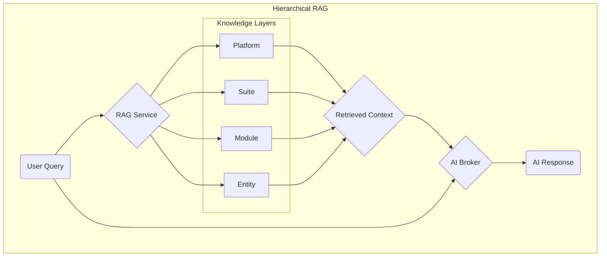

```mermaid
graph TD
    subgraph Hierarchical RAG
        A(User Query) --> B{RAG Service}

        subgraph Knowledge Layers
            C[Platform]
            D[Suite]
            E[Module]
            F[Entity]
        end

        B --> C
        B --> D
        B --> E
        B --> F

        C --> G{Retrieved Context}
        D --> G
        E --> G
        F --> G

        G --> H{AI Broker}
        A --> H

        H --> I(AI Response)
    end
```
