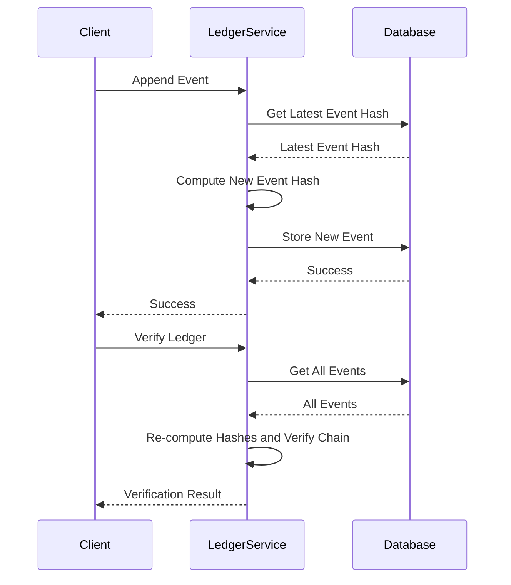

```mermaid
sequenceDiagram
    participant Client
    participant LedgerService
    participant Database

    Client->>LedgerService: Append Event
    LedgerService->>Database: Get Latest Event Hash
    Database-->>LedgerService: Latest Event Hash
    LedgerService->>LedgerService: Compute New Event Hash
    LedgerService->>Database: Store New Event
    Database-->>LedgerService: Success
    LedgerService-->>Client: Success

    Client->>LedgerService: Verify Ledger
    LedgerService->>Database: Get All Events
    Database-->>LedgerService: All Events
    LedgerService->>LedgerService: Re-compute Hashes and Verify Chain
    LedgerService-->>Client: Verification Result
```
