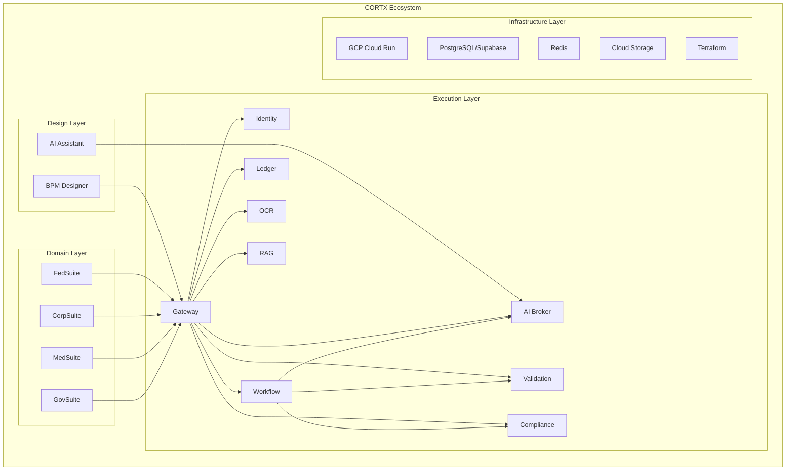

```mermaid
graph TD
    subgraph CORTX Ecosystem
        subgraph Design Layer
            A[BPM Designer]
            B[AI Assistant]
        end
        subgraph Execution Layer
            C[Gateway]
            D[Identity]
            E[Validation]
            F[AI Broker]
            G[Workflow]
            H[Compliance]
            I[Ledger]
            J[OCR]
            K[RAG]
        end
        subgraph Domain Layer
            L[FedSuite]
            M[CorpSuite]
            N[MedSuite]
            O[GovSuite]
        end
        subgraph Infrastructure Layer
            P[GCP Cloud Run]
            Q[PostgreSQL/Supabase]
            R[Redis]
            S[Cloud Storage]
            T[Terraform]
        end
    end

    A --> C
    B --> F
    C --> D
    C --> E
    C --> F
    C --> G
    C --> H
    C --> I
    C --> J
    C --> K

    G --> E
    G --> F
    G --> H

    L --> C
    M --> C
    N --> C
    O --> C
```
