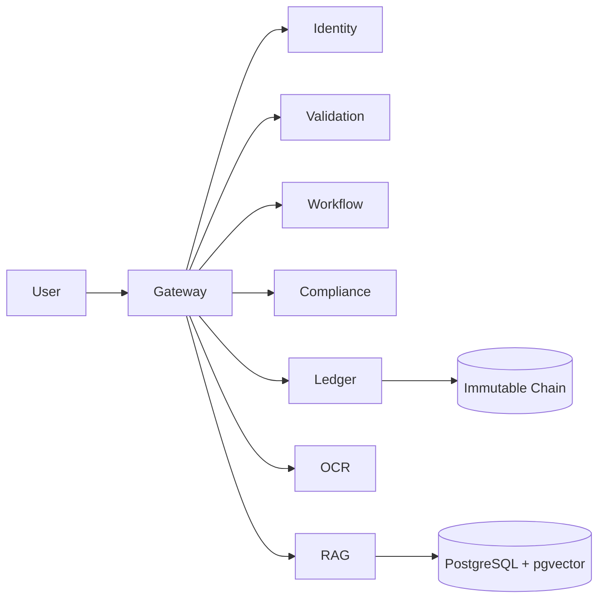

# System Diagrams

This document contains high-level architecture diagrams for the CORTX platform.

## High-Level Topology

```mermaid
flowchart LR
  User-->Gateway
  Gateway-->Identity & Validation & Workflow & Compliance & Ledger & OCR & RAG
  RAG-->DB[(PostgreSQL + pgvector)]
  Ledger-->Evidence[(Immutable Chain)]
```
