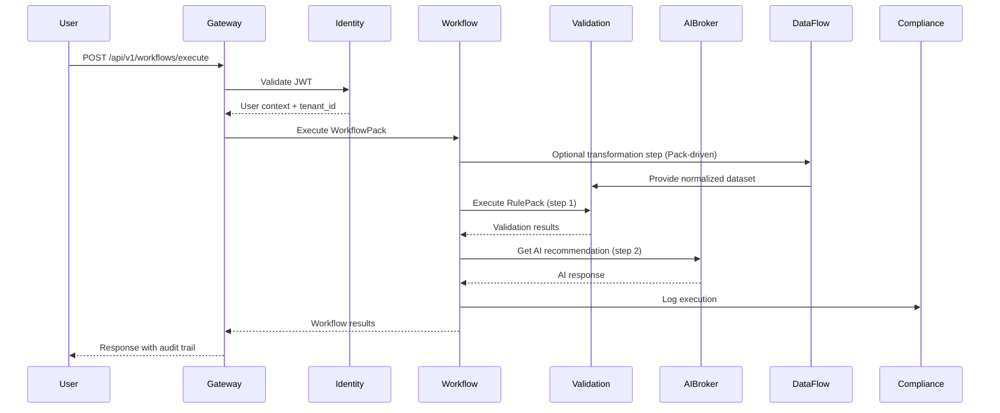
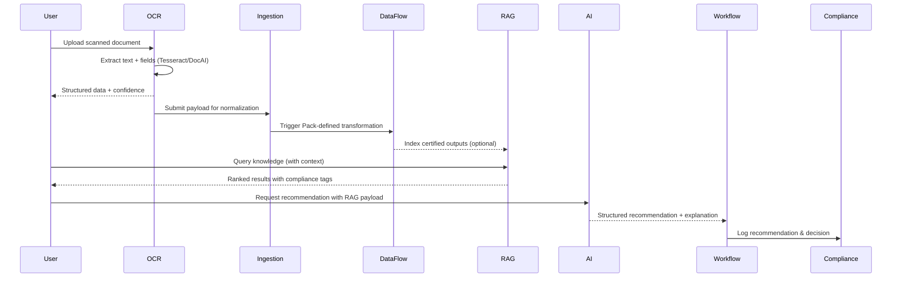

## 3. Technical Architecture

### 3.1 Platform Services

#### 3.1.1 Gateway Service (Port 8080)

**Technology**: FastAPI (Python 3.11), Uvicorn, Redis
**Purpose**: API routing, rate limiting, request/response transformation

**Capabilities**:

- Reverse proxy to all platform services
- Rate limiting (100 req/sec per tenant, burst 200)
- Request authentication (JWT validation)
- CORS handling
- Request/response logging
- Circuit breaker for downstream services

**Endpoints**:

```python
GET  /health                    # Health check
POST /api/v1/rulepacks/execute  # Execute RulePack
POST /api/v1/workflows/execute  # Execute WorkflowPack
GET  /api/v1/services           # Service discovery
```

#### 3.1.2 Identity Service (Port 8082)

**Technology**: FastAPI, PostgreSQL, JWT, Supabase Auth
**Purpose**: Authentication, authorization, tenant management

**Features**:

- OAuth 2.0 / OpenID Connect support
- Multi-factor authentication (MFA)
- JWT token issuance (15min access, 7day refresh)
- Role-Based Access Control (RBAC)
- Tenant onboarding automation

**Claims in JWT**:

```json
{
  "sub": "user_123",
  "tenant_id": "agency-dod-001",
  "roles": ["SUITE_OPERATOR", "PACK_AUTHOR"],
  "permissions": ["execute:workflows", "create:packs"],
  "exp": 1696089825
}
```

#### 3.1.3 AI Broker Service (Port 8085)

**Technology**: FastAPI, LangChain, Google Vertex AI, Redis (cache)
**Purpose**: AI model orchestration, RAG, PII protection

**Components**:

- **Model Router**: Select model based on cost, latency, compliance requirements
- **Prompt Manager**: Template management with variable injection
- **RAG Engine**: Vector search (384-dim embeddings, cosine similarity)
- **PII Redactor**: Regex + NER-based sensitive data removal

**RAG Vector Store**:

- 15+ embedded documents (Treasury rules, HIPAA guidelines, etc.)
- Semantic search with keyword boosting
- Top-k retrieval (default k=5, threshold=0.5)
- Real-time knowledge base updates

**API Endpoints**:

```python
POST /api/ai/inference          # Generate AI response
POST /api/ai/explain            # Explain rule failure
POST /api/ai/generate-workflow  # NL → WorkflowPack
GET  /api/ai/models             # Available models
POST /api/ai/rag/search         # Search knowledge base
```

#### 3.1.4 Validation Service (Port 8083)

**Technology**: FastAPI, Pydantic, Safe eval engine
**Purpose**: RulePack execution, data validation

**Safe Operators** (no code injection):

- Comparison: `==`, `!=`, `<`, `<=`, `>`, `>=`
- Membership: `in`, `not_in`
- String: `contains`, `starts_with`, `ends_with`, `matches` (regex)
- Null checks: `is_null`, `is_not_null`

**Validation Flow**:

1. Load RulePack from registry
2. Parse input data (JSON, CSV, XML)
3. Apply rules sequentially
4. Collect violations (FATAL, WARNING, INFO)
5. Return results with contextual errors

#### 3.1.5 Workflow Service (Port 8130)

**Technology**: FastAPI, Temporal.io (planned), Redis (current)
**Purpose**: WorkflowPack orchestration, saga pattern

**Features**:

- Sequential and parallel step execution
- Conditional branching (decision nodes)
- Human-in-the-loop approval gates
- Automatic compensation on failure
- Event-driven cross-suite workflows

**Saga Pattern** (distributed transactions):

```yaml
saga:
  steps:
    - id: step1
      compensate: rollback_step1
    - id: step2
      compensate: rollback_step2

  on_failure:
    - execute: rollback_step2
    - execute: rollback_step1
    - notify: failure_alert
```

#### 3.1.6 Compliance Service (Port 8135)

**Technology**: FastAPI, PostgreSQL (time-series), Cloud Logging
**Purpose**: Audit logging, compliance reporting

**Capabilities**:

- Immutable audit trail (append-only)
- Compliance report generation (FISMA, FedRAMP, HIPAA)
- NIST 800-53 control evidence collection
- Automated compliance attestation
- Retention policy enforcement

#### 3.1.7 Schema Service (Port 8084)

**Technology**: FastAPI, JSON Schema, YAML validation
**Purpose**: Schema registry, RulePack/WorkflowPack validation

**Schemas**:

- RulePack schema (JSON Schema draft-07)
- WorkflowPack schema (YAML with JSON Schema validation)
- Data schema registry (for input/output validation)
- Version management (semantic versioning)

#### 3.1.8 RAG Service (svc-rag, Port 8138)

**Technology**: FastAPI, PostgreSQL with pgvector, LangChain
**Purpose**: Centralized, hierarchical knowledge retrieval, indexing, and management, enabling contextual AI assistance that understands knowledge at Platform, Suite, Module, and Entity levels.

**Architecture**:

- **Hierarchical Knowledge**: Implements a 4-level knowledge hierarchy (Platform, Suite, Module, Entity) to provide contextual awareness. Retrieval cascades from the narrowest scope (Module/Entity) outwards.
- **Vector Store**: Utilizes PostgreSQL with the `pgvector` extension for efficient similarity search. The schema supports tenant isolation via Row-Level Security (RLS).
- **Embedding Model**: `sentence-transformers/all-MiniLM-L6-v2` (384 dimensions), with cosine similarity for retrieval.
- **Contextual Retrieval**: Employs a "Cascading Context Pattern" that searches across hierarchical levels and combines results. A context priority score boosts relevance based on specificity (Entity > Module > Suite > Platform).

**Database Schema (`rag.chunks`)**:

```sql
CREATE TABLE rag.chunks (
    id UUID PRIMARY KEY,
    document_id UUID NOT NULL REFERENCES rag.documents(id),
    ord INT NOT NULL,
    content TEXT NOT NULL,
    meta JSONB,
    embedding VECTOR(384)
);
CREATE INDEX idx_chunks_embedding ON rag.chunks USING ivfflat (embedding vector_cosine_ops) WITH (lists = 100);
```

**Hierarchical Retrieval Logic**:

```python
# services/rag/app/hierarchical_retrieval.py
async def retrieve_context(
    query_embedding: List[float],
    tenant_id: str,
    suite_id: str,
    module_id: str,
    levels: List[str] = ["entity", "module", "suite", "platform"]
) -> List[Dict[str, Any]]:
    # ... implementation searches across levels ...
    # ... boosts scores based on level ...
    # ... returns combined, re-ranked results ...
```

**API Endpoints**:
The service exposes endpoints for ingestion, knowledge management, and search, which are consumed by the RAG Management UI in the CORTX Designer.

```python
# RAG Management API
POST   /v1/rag/ingest                 # Ingest document/URL with scope
GET    /v1/rag/knowledge               # List knowledge base with filters
DELETE /v1/rag/knowledge/{id}          # Delete knowledge
POST   /v1/rag/search                  # Hierarchical search
GET    /v1/rag/progress/{job_id}       # Check ingestion progress
```

#### 3.1.9 OCR Service (Port 8137)

**Status**: ✅ **Implemented** | **Version**: 1.0.0
**Technology**: FastAPI, Tesseract OCR, Claude 3.5 Sonnet Vision, Pillow, OpenCV, pdf2image
**Purpose**: AI-enhanced optical character recognition with multi-tier processing pipeline

**Multi-Tier Architecture**:

- **Tier 1 - Tesseract OCR** (Free, Fast):
  - Modern printed documents
  - 100-300ms per page, 85-95% accuracy
  - Automatic escalation on low confidence (<80%)

- **Tier 2 - Claude 3.5 Sonnet Vision** (AI-Enhanced):
  - Historical documents, handwritten text, complex layouts
  - 2-5 seconds per page, 90-98% accuracy
  - Triggers when Tesseract confidence <80%
  - Requires `ANTHROPIC_API_KEY` environment variable

- **Tier 3 - Human Review** (100% Accuracy):
  - Critical documents requiring perfect fidelity
  - Corrections stored in `ocr_reviews` table
  - Used for continuous improvement

**Smart Features**:

- **SHA-256 Hash Caching**: Prevents reprocessing identical documents
- **Automatic Tier Escalation**: Low-confidence results trigger higher tiers
- **Document Preprocessing**: Adaptive thresholding, denoising, deskewing
- **Multi-page PDF Support**: Batch processing with page-level results
- **Structured Field Extraction**: JSON schema mapping for domain-specific forms
- **Multi-tenant Job Tracking**: Tenant-isolated job history and audit trail

**Database Schema**:

```sql
-- Job tracking with status progression
ocr_jobs (id, tenant_id, document_hash, status, tier_used,
          confidence_score, extracted_text, extracted_fields,
          processing_time_ms, created_at, user_id)

-- Human review corrections
ocr_reviews (id, job_id, reviewer_id, corrected_text,
             corrected_fields, confidence_after_review)

-- Hash-based result cache
ocr_cache (document_hash PRIMARY KEY, extracted_text,
           extracted_fields, tier_used, hit_count, last_accessed_at)
```

**Processing Flow**:

```
1. Document Upload → SHA-256 Hash
2. Cache Lookup (hit_count++)
3. If cache miss → Tesseract OCR
4. If confidence < 80% → Claude Vision API
5. If confidence < 85% → Flag for Human Review
6. Store results + Update cache
7. Log to Ledger service (audit trail)
```

**Use Cases**:

- **PropVerify**: Title documents, deeds, liens (historical records)
- **DataFlow**: Legacy PDF reports, bank statements
- **ClaimsVerify**: Healthcare claims, EOB forms
- **FedReconcile**: Scanned Treasury reports, invoices

**API Endpoints**:

```python
# Health & Monitoring
GET  /health                    # Detailed health (Tesseract, Claude, DB)
GET  /healthz                   # Kubernetes liveness
GET  /readyz                    # Kubernetes readiness
GET  /stats                     # Service statistics (tier usage, cache hits)

# OCR Processing
POST /extract                   # Submit document (multipart/form-data)
GET  /jobs/{job_id}            # Get job status and results
PUT  /jobs/{job_id}/review     # Submit human corrections

# Caching
GET  /cache/{document_hash}    # Check for cached results
```

**Performance**:

- **Tesseract**: 10-20 pages/sec (parallel)
- **Claude Vision**: 15-30 pages/min (API rate limits)
- **Cache Hit**: <10ms response time
- **Database Pool**: 10 connections, 20 overflow

**Integration**:

- **Gateway Routes**: `/api/v1/ocr/*` → `http://ocr:8137/*`
- **RAG Ingestion**: Extracted text indexed for semantic search
- **Ledger Logging**: Job metadata logged for compliance audit
- **Compliance Reports**: OCR confidence scores tracked

#### 3.1.10 Ledger Service (svc-ledger, Port 8136)

**Technology**: FastAPI, PostgreSQL with cryptographic hashing
**Purpose**: Provides an immutable, tamper-evident audit trail for compliance-critical operations across all modules, enabling end-to-end provenance for RAG actions and other events.

**Architecture**:

- **Immutable Log**: Implemented using a PostgreSQL table where `UPDATE` and `DELETE` permissions are revoked.
- **Cryptographic Hashing**: Each entry is chained to the previous one using a SHA-256 hash of its contents and the previous entry's hash, forming a blockchain-like structure.
- **Tenant Isolation**: All ledger entries are scoped to a specific tenant.
- **Verification**: An API endpoint allows for the verification of any entry's integrity by recalculating its hash and verifying the entire chain.

**Database Schema (`ledger.blocks`)**:

```sql
CREATE TABLE ledger.blocks (
    id UUID PRIMARY KEY,
    tenant_id VARCHAR(100) NOT NULL,
    block_hash VARCHAR(64) NOT NULL UNIQUE,
    previous_hash VARCHAR(64),
    event_type VARCHAR(100) NOT NULL,
    data_hash VARCHAR(64) NOT NULL, -- Hash of the actual event data
    metadata JSONB,
    created_at TIMESTAMP NOT NULL DEFAULT NOW(),
    created_by VARCHAR(255) NOT NULL
);
```

**Use Cases**:

- **RAG Provenance**: Logging all ingestion, deletion, and query events served to end-users.
- **FedReconcile**: Creating a verifiable audit trail for GTAS submissions.
- **PropVerify**: Recording the history of title chain verifications.
- **Compliance**: Generating tamper-proof audit reports for compliance attestations.

**API Endpoints**:

```python
# Append a new, immutable entry to the ledger
POST /v1/ledger/append

# Verify the integrity of a specific ledger entry
GET /v1/ledger/verify/{entry_id}

# Retrieve historical events for an entity or tenant
GET /v1/ledger/history

# Generate a formal compliance audit report
POST /v1/ledger/audit-report
```

#### 3.1.11 Config Service (Port 8086)

**Technology**: FastAPI, PostgreSQL, Redis cache
**Purpose**: Centralized configuration registry with tenant-aware overrides

**Capabilities**:

- Hierarchical configuration (platform → suite → module → tenant)
- Versioned config bundles with rollout/rollback support
- Feature flags and kill switches propagated via Gateway and SDKs
- Secrets indirection (references resolved via Secret Manager)

**API Endpoints**:

```python
GET  /api/config/{tenant_id}/effective    # Merge chain for caller context
POST /api/config/bundles                  # Publish new bundle version
POST /api/config/rollouts/{bundle_id}/promote
```

#### 3.1.12 Packs Registry Service (Port 8089)

**Technology**: FastAPI, PostgreSQL, object storage
**Purpose**: Source of truth for RulePack and WorkflowPack metadata

**Capabilities**:

- Pack catalog with semantic versioning and status (draft → certified → deprecated)
- Ownership metadata (author, reviewers, certification date)
- Artifact storage pointers (JSON/YAML stored in `cortx-packs` repository)
- Dependency graph (workflow packs referencing rule packs and schema versions)

#### 3.1.13 RulePack Registry Service (Port 8091)

**Technology**: FastAPI, JSON Schema validation
**Purpose**: Validates, signs, and distributes RulePack payloads to Validation service

**Capabilities**:

- Schema validation against `RulePack` JSON Schema
- Cryptographic signing of certified packs
- Promotion workflow hooks (draft → review → certified)
- Sync jobs that hydrate Validation service caches and SDK manifests

#### 3.1.14 Ingestion Service (Port 8092)

**Technology**: FastAPI, Celery workers, GCS/BigQuery connectors
**Purpose**: Uniform ingestion pipeline for batch and streaming data sources

**Capabilities**:

- Connector framework (SFTP, REST, database replication, file drop)
- Data normalization into Pack-defined schemas
- PII scrubbing and lineage tagging prior to validation
- Emits ingestion events to Events service and forwards payloads to DataFlow

#### 3.1.15 Events Service (Port 8094)

**Technology**: FastAPI, Pub/Sub, Redis Streams
**Purpose**: Publish/subscribe backbone for cross-suite coordination

**Capabilities**:

- Managed topics for workflow lifecycle, pack deployments, ingestion completions
- Durable subscriptions for suites, SDK clients, and external webhooks
- Event schema catalog with validation (Avro/JSON Schema)
- Replay and dead-letter queue handling

#### 3.1.16 Observability Service (Port 8096)

**Technology**: FastAPI, OpenTelemetry collector, Prometheus, Grafana provisioning
**Purpose**: Centralized logging, metrics, and tracing for platform and suites

**Capabilities**:

- Streams structured logs to Cloud Logging with tenant metadata
- Scrapes service metrics and exposes consolidated dashboards
- Tracing pipeline (OTel → Cloud Trace/Grafana Tempo) with trace sampling policies
- Alert definitions as code synchronized with Operations playbooks

#### 3.1.17 Compliance Scanner Service (Port 8140)

**Technology**: FastAPI, Python scanners, Open Policy Agent
**Purpose**: Static and runtime compliance scanning for code, infrastructure, and data assets

**Capabilities**:

- Executes scanner packs (e.g., FedRAMP, HIPAA, NIST) against repositories and configs
- Integrates with CI for pre-merge enforcement and generates Ledger entries
- Supports suppressions with expiry and justifications tracked per tenant
- Emits findings to Compliance service for certification workflows

#### 3.1.18 DataFlow Service (Port 8145)

**Technology**: FastAPI, dbt/SQL transformation runners, Airflow (managed)
**Purpose**: Enterprise data transformation and reconciliation engine formerly branded "FedTransform"

**Capabilities**:

- Orchestrates Pack-defined ETL pipelines triggered by Ingestion events
- Library of vertical-specific transformations (Fed, Corp, Med, Gov) maintained as Packs
- Auto-generates reconciliation evidence and publishes to Workflow + Ledger services
- Provides Designer/SDK hooks for previewing transformations and lineage graphs

### 3.2 Data Flow

**Typical Execution Flow**:



**OCR → DataFlow → RAG → AI Sequence**:



### 3.3 Security Architecture

- **Identity & Access Management**: OAuth 2.0/OIDC, RBAC, MFA, tenant context propagation
- **Data Security**: Encryption at rest (Cloud KMS), TLS 1.3 in transit, tenant-specific secrets
- **Network Security**: Private service mesh, firewall rules, VPC Service Controls
- **Compliance Controls**: FedRAMP / NIST 800-53 mappings, audit log immutability, continuous monitoring
- **AI Safety**: Prompt/output filtering, PII scrubbing, model version pinning, explainability artifacts stored in Ledger

---
