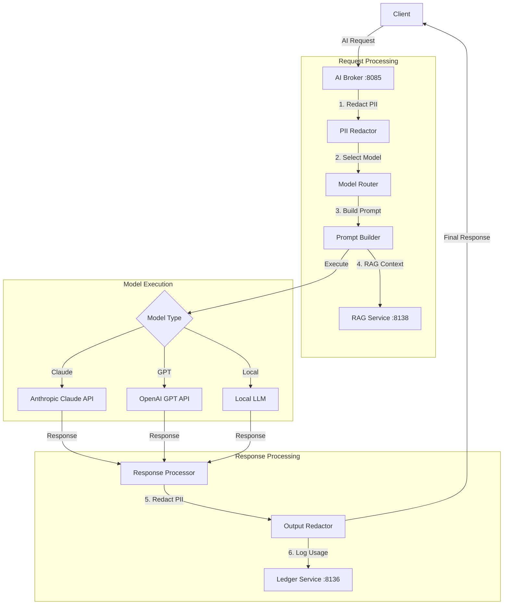

# AI Broker Service (Port 8085)

**Status:** ✅ Implemented | **Version:** 0.1.0

## Overview

The AI Broker service provides a unified interface to various AI models and AI-powered features across the CORTX platform. It handles model routing, prompt management, PII redaction, and integrates with the RAG service for context-aware AI responses.

## Core Responsibilities

### AI Model Routing

- **Intelligent Routing**: Route requests to optimal AI model
- **Cost Optimization**: Select model based on cost/performance trade-offs
- **Model Selection**: Claude, GPT-4, local models
- **Fallback Handling**: Automatic failover on model unavailability

### Prompt Management

- **Template Library**: Reusable prompt templates
- **Prompt Engineering**: Optimized prompts for specific tasks
- **Variable Substitution**: Dynamic prompt generation
- **Version Control**: Track prompt iterations

### PII Redaction

- **Automatic Detection**: Identify PII in prompts/responses
- **Redaction**: Remove/mask sensitive data before AI processing
- **Compliance**: HIPAA, GDPR, PII protection
- **Audit Trail**: Log all redaction events

### RAG Integration

- **Context Retrieval**: Fetch relevant knowledge from RAG service
- **Context Injection**: Augment prompts with retrieved context
- **Hierarchical Context**: Use suite/module-scoped knowledge
- **Citation Generation**: Link responses to source documents

## Architecture Diagram



## API Endpoints

### Health & Status

- `GET /healthz` - Liveness probe
- `GET /readyz` - Readiness probe
- `GET /` - Service metadata

### AI Inference

- `POST /api/ai/inference` - Generate AI response

  ```json
  {
    "prompt": "Explain title insurance",
    "model": "claude-3-5-sonnet-20241022",
    "use_rag": true,
    "context": {
      "suite_id": "fedsuite",
      "module_id": "title"
    },
    "max_tokens": 1000
  }
  ```

- `POST /api/ai/explain` - Explain validation failure

  ```json
  {
    "rule_id": "title.verification",
    "failure_data": {...},
    "include_remediation": true
  }
  ```

- `POST /api/ai/generate-workflow` - Generate WorkflowPack from natural language

  ```json
  {
    "description": "Create a workflow for title transfer with legal approval",
    "domain": "legal"
  }
  ```

### Model Management

- `GET /api/ai/models` - List available AI models
- `GET /api/ai/models/{model_id}/status` - Get model status
- `POST /api/ai/models/{model_id}/test` - Test model availability

### Prompt Management

- `GET /api/ai/prompts` - List prompt templates
- `POST /api/ai/prompts` - Create prompt template
- `GET /api/ai/prompts/{template_id}` - Get prompt template

## AI Models

### Claude Models (Anthropic)

- **claude-3-5-sonnet-20241022**: Best for complex reasoning
- **claude-3-haiku-20240307**: Fast, cost-effective
- **claude-3-opus-20240229**: Most capable, highest cost

### OpenAI Models

- **gpt-4-turbo**: High-quality general purpose
- **gpt-4**: Legacy, still capable
- **gpt-3.5-turbo**: Fast, lower cost

### Local Models (Future)

- **llama-3-70b**: On-premise deployment
- **mistral-7b**: Lightweight local model

## PII Redaction

### Automatic Detection

- Social Security Numbers (SSN)
- Credit card numbers
- Email addresses
- Phone numbers
- Physical addresses
- Custom patterns (configurable)

### Redaction Strategies

- **Mask**: Replace with `***`
- **Hash**: SHA-256 hash for consistency
- **Tokenize**: Replace with unique tokens
- **Remove**: Complete removal

### Example

```
Input:  "John Doe's SSN is 123-45-6789"
Output: "John Doe's SSN is ***-**-****"
```

## RAG Integration

### Context Augmentation

```python
# Without RAG
prompt = "What is title insurance?"

# With RAG
context = rag.retrieve("title insurance", suite_id="fedsuite")
prompt = f"""
Based on this context:
{context}

Answer: What is title insurance?
"""
```

### Hierarchical Context

The AI Broker leverages RAG's 4-level hierarchy:

1. Entity-specific knowledge
2. Module-specific knowledge
3. Suite-specific knowledge
4. Platform-global knowledge

## Configuration

### Environment Variables

```bash
# Service
PORT=8085
LOG_LEVEL=INFO

# AI Models
ANTHROPIC_API_KEY=sk-ant-xxx
OPENAI_API_KEY=sk-xxx
DEFAULT_MODEL=claude-3-5-sonnet-20241022

# RAG Integration
RAG_SERVICE_URL=http://localhost:8138

# Gateway Integration
CORTX_GATEWAY_URL=http://localhost:8080

# PII Redaction
ENABLE_PII_REDACTION=true
REDACTION_MODE=mask  # mask, hash, remove

# Authentication
REQUIRE_AUTH=false  # Set to "true" for production
```

## Usage Examples

### Generate AI Response

```bash
curl -X POST http://localhost:8085/api/ai/inference \
  -H "Content-Type: application/json" \
  -H "X-Tenant-ID: tenant-123" \
  -d '{
    "prompt": "What are the steps for title verification?",
    "model": "claude-3-5-sonnet-20241022",
    "use_rag": true,
    "context": {
      "suite_id": "fedsuite",
      "module_id": "title"
    },
    "max_tokens": 1000
  }'
```

Response:

```json
{
  "response": "Title verification involves the following steps:\n1. ...",
  "model_used": "claude-3-5-sonnet-20241022",
  "tokens_used": 487,
  "rag_chunks_used": 5,
  "sources": ["Title Verification Guide", "Legal Requirements"],
  "correlation_id": "req-abc123"
}
```

### Explain Validation Failure

```bash
curl -X POST http://localhost:8085/api/ai/explain \
  -H "Content-Type: application/json" \
  -d '{
    "rule_id": "title.verification.ownership",
    "failure_data": {
      "property_id": "prop-123",
      "issue": "ownership_mismatch"
    },
    "include_remediation": true
  }'
```

### Generate WorkflowPack

```bash
curl -X POST http://localhost:8085/api/ai/generate-workflow \
  -H "Content-Type: application/json" \
  -d '{
    "description": "Create a workflow for property title transfer with legal approval and lien verification",
    "domain": "legal"
  }'
```

Response:

```json
{
  "workflow_pack": {
    "id": "wp-generated-001",
    "name": "Property Title Transfer",
    "steps": [
      {"name": "verify_ownership", "type": "validation"},
      {"name": "check_liens", "type": "validation"},
      {"name": "legal_approval", "type": "hil_approval"},
      {"name": "transfer_title", "type": "action"}
    ]
  },
  "confidence": 0.92,
  "model_used": "claude-3-5-sonnet-20241022"
}
```

### List Available Models

```bash
curl http://localhost:8085/api/ai/models \
  -H "Authorization: Bearer <token>"
```

Response:

```json
{
  "models": [
    {
      "id": "claude-3-5-sonnet-20241022",
      "provider": "anthropic",
      "status": "available",
      "cost_per_1k_tokens": 0.003
    },
    {
      "id": "gpt-4-turbo",
      "provider": "openai",
      "status": "available",
      "cost_per_1k_tokens": 0.01
    }
  ]
}
```

## Performance

### Throughput

- **Simple Prompts**: ~50 requests/second
- **RAG-Enhanced**: ~20 requests/second
- **Complex Generation**: ~5 requests/second

### Latency

- **Claude 3.5 Sonnet**: 2-5s
- **Claude 3 Haiku**: 0.5-2s
- **GPT-4 Turbo**: 3-6s

### Cost Optimization

- Automatic model selection based on complexity
- Caching for repeated prompts
- Token usage tracking and limits

## Security Features

### PII Protection

- Automatic redaction before AI processing
- Audit log of all redactions
- Compliance with HIPAA/GDPR

### API Key Management

- Secure storage of provider API keys
- Key rotation support
- Usage quotas and rate limiting

### Content Filtering

- Input validation
- Output sanitization
- Harmful content detection

## Documentation

- **OpenAPI Spec**: [openapi.yaml](./openapi.yaml)
- **Source Code**: `/services/ai-broker/app/main.py`
- **Claude API**: [Anthropic Documentation](https://docs.anthropic.com/)

## Support

For issues or questions:

- GitHub Issues: [sinergysolutionsllc/sinergysolutionsllc](https://github.com/sinergysolutionsllc/sinergysolutionsllc/issues)
- Internal Documentation: `/docs/services/ai-broker/`
