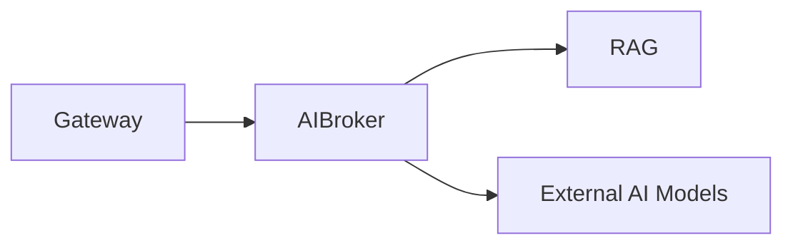

# AI Broker (8085)

**Purpose:** The AI Broker service provides a unified interface to various AI models and handles AI-related tasks like PII redaction and RAG.

**Responsibilities:**
- Route requests to the optimal AI model (cost, speed, compliance).
- Manage prompts and templates.
- Perform Retrieval-Augmented Generation (RAG) using the RAG service.
- Redact Personally Identifiable Information (PII) from prompts before sending them to AI models.

**Authentication:** This service is internal to the platform and is called by the Gateway or other services.

**Sample endpoints:**
- `POST /api/ai/inference`: Generate an AI response.
- `POST /api/ai/explain`: Explain a rule failure.
- `POST /api/ai/generate-workflow`: Generate a WorkflowPack from natural language.
- `GET /api/ai/models`: Get a list of available AI models.

**OpenAPI:** [openapi.yaml](./openapi.yaml)
