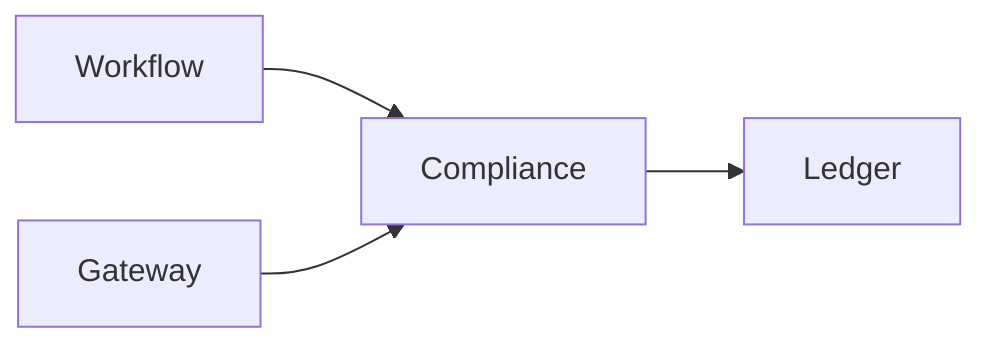

# Compliance (8135)

**Purpose:** The Compliance service is responsible for audit logging and compliance reporting.

**Responsibilities:**
- Maintain an immutable audit trail of all platform events.
- Generate compliance reports for various regulatory frameworks (FISMA, FedRAMP, HIPAA).
- Collect evidence for NIST 800-53 controls.
- Enforce data retention policies.

**Authentication:** This service is internal to the platform and is called by other services to log events.

**Sample endpoints:**
- `POST /log`: Log an event to the audit trail.
- `GET /report`: Generate a compliance report.

**OpenAPI:** [openapi.yaml](./openapi.yaml)
