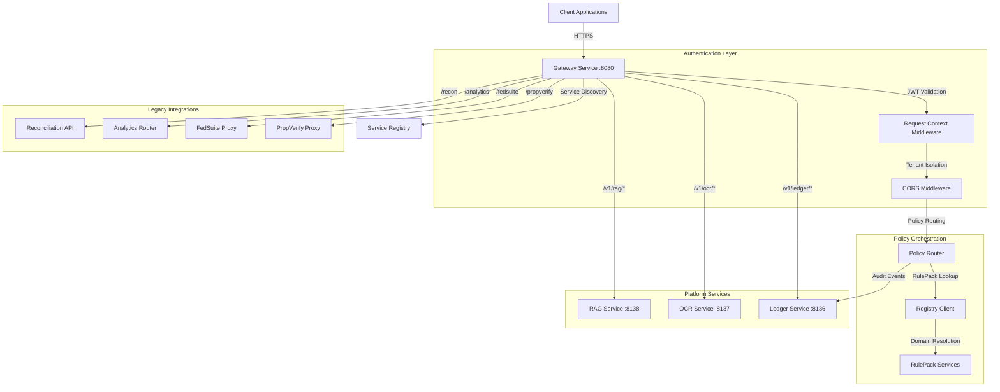

# Gateway Service (Port 8080)

**Status:** ✅ Implemented | **Version:** 0.1.0

## Overview

The Gateway service is the unified entry point for all external traffic into the CORTX platform. It provides intelligent request routing, policy-based validation orchestration, and seamless integration with all platform services through a single, cohesive API surface.

## Core Responsibilities

### API Gateway Functions

- **Reverse Proxy**: Routes requests to appropriate backend services
- **Request Authentication**: JWT validation and tenant isolation
- **CORS Management**: Configurable cross-origin resource sharing
- **Service Discovery**: Dynamic routing to platform services
- **Health Aggregation**: Unified health checks across all services

### Policy Orchestration

- **RulePack Integration**: Dynamic policy routing via RegistryClient
- **Validation Modes**: Static, AI-enhanced, and hybrid validation
- **Failure Explanation**: AI-powered failure analysis and remediation
- **Audit Logging**: Comprehensive event tracking for compliance

### Platform Service Proxying

- **RAG Service**: Hierarchical retrieval and document management
- **OCR Service**: Text extraction and document processing
- **Ledger Service**: Immutable audit trail and event logging
- **Analytics**: Hybrid AI/JSON validation analytics

## Architecture Diagram



## Key Features

### Smart Request Routing

The Gateway uses a sophisticated **PolicyRouter** that:

- Dynamically resolves validation requests to appropriate RulePacks
- Supports domain-based routing (e.g., "recon", "claims", "gov")
- Handles multiple validation modes (static JSON, AI-enhanced, hybrid)
- Provides fallback routing and error handling

### Multi-Tenant Isolation

Every request is scoped by tenant:

- `X-Tenant-ID` header required on all authenticated endpoints
- Row-level security enforced in downstream services
- Audit events tagged with tenant context
- Request correlation via `X-Request-ID`

### Service Health Aggregation

Comprehensive health checking:

- Orchestrator health includes RulePack connectivity
- Platform service health proxied from RAG/OCR/Ledger
- Kubernetes-compatible `/healthz` and `/readyz` probes
- Detailed `/_info` endpoint with service metadata

### CORS Configuration

Flexible cross-origin support:

- Configurable allowed origins via `ALLOWED_ORIGINS` environment variable
- Credential support for authenticated requests
- Custom header exposure (`x-request-id`, `x-tenant-id`)
- Wildcard support for development environments

## API Endpoints

### Core Gateway

- `GET /` - Root endpoint with service metadata
- `GET /health` - Health check (orchestrator + policy router)
- `GET /_info` - Service information and feature list

### Service Discovery

- `GET /v1/services` - List all available CORTX services with URLs and status

### Policy Orchestration

- `POST /jobs/validate` - Create and execute validation job
  - **Parameters**: `domain`, `mode`, `input_ref`, `input_data`, `options`
  - **Headers**: `X-Tenant-ID`, `X-Request-ID`
  - **Modes**: `static`, `ai`, `hybrid`
- `GET /jobs/{job_id}` - Get validation job status and results
- `POST /explain` - Get AI explanation for validation failure
- `PUT /failures/{failure_id}/decision` - Record user decision on failure
- `POST /feedback/rag/{interaction_id}` - Submit feedback on AI explanations

### Platform Services (Proxied)

#### RAG Service (`/v1/rag/*`)

- `POST /v1/rag/query` - Query with hierarchical context
- `POST /v1/rag/retrieve` - Retrieve chunks without generation
- `POST /v1/rag/documents/upload` - Upload document to knowledge base
- `GET /v1/rag/documents` - List indexed documents
- `DELETE /v1/rag/documents/{document_id}` - Remove document
- `GET /v1/rag/healthz` - RAG health check
- `GET /v1/rag/readyz` - RAG readiness probe

#### OCR Service (`/v1/ocr/*`)

- `POST /v1/ocr/extract` - Extract text from document
- `GET /v1/ocr/results/{job_id}` - Get extraction results
- `GET /v1/ocr/healthz` - OCR health check
- `GET /v1/ocr/readyz` - OCR readiness probe

#### Ledger Service (`/v1/ledger/*`)

- `POST /v1/ledger/append` - Append event to ledger
- `GET /v1/ledger/verify` - Verify ledger integrity
- `GET /v1/ledger/events` - List ledger events
- `GET /v1/ledger/export` - Export events as CSV
- `GET /v1/ledger/healthz` - Ledger health check
- `GET /v1/ledger/readyz` - Ledger readiness probe

### Legacy Routes

- `POST /orchestrator/*` - Primary orchestration API (backward compatibility)
- `GET /analytics/*` - Hybrid validation analytics
- `GET /recon/*` - Reconciliation API (cortx_recon package)
- `GET /fedsuite/*` - FedSuite proxy with JWT auth
- `GET /propverify/*` - PropVerify proxy (dev/local only)

## Configuration

### Environment Variables

```bash
# Registry Connection (required for policy routing)
CORTX_REGISTRY_URL=http://localhost:8081

# Platform Service URLs (defaults shown)
RAG_SERVICE_URL=http://localhost:8138
OCR_SERVICE_URL=http://localhost:8137
LEDGER_SERVICE_URL=http://localhost:8136

# CORS Configuration
ALLOWED_ORIGINS=http://localhost:3000,http://127.0.0.1:3000

# Environment Label
CORTX_ENV=dev

# Logging
LOG_LEVEL=INFO

# Service Port
PORT=8080
```

### Dependencies

The Gateway requires these Python packages:

- `fastapi` - Web framework
- `uvicorn` - ASGI server
- `httpx` - HTTP client for proxying
- `cortx_core` - Core utilities (logging, middleware, auditing)
- `cortx_rulepack_sdk` - RulePack contracts and registry client
- `cortx_recon` - Reconciliation API router

## Usage Examples

### Submit Validation Request

```bash
curl -X POST http://localhost:8080/jobs/validate \
  -H "X-Tenant-ID: tenant-123" \
  -H "Content-Type: application/json" \
  -d '{
    "domain": "recon",
    "mode": "static",
    "input_data": [
      {"account": "12345", "amount": 1000.00}
    ],
    "options": {
      "strict_mode": true,
      "include_warnings": true
    }
  }' \
  --url-query "domain=recon&mode=static"
```

### Get Validation Results

```bash
curl http://localhost:8080/jobs/{job_id} \
  -H "X-Tenant-ID: tenant-123"
```

### Explain Validation Failure

```bash
curl -X POST http://localhost:8080/explain \
  -H "X-Tenant-ID: tenant-123" \
  -H "Content-Type: application/json" \
  -d '{
    "domain": "recon",
    "failure_id": "fail-001",
    "failure_data": {
      "rule_id": "recon.balance_check",
      "record": {"account": "12345"},
      "message": "Balance mismatch"
    },
    "include_remediation": true
  }'
```

### Query RAG Service (via Gateway)

```bash
curl -X POST http://localhost:8080/v1/rag/query \
  -H "X-Tenant-ID: tenant-123" \
  -H "Content-Type: application/json" \
  -d '{
    "question": "What are the reconciliation rules?",
    "collection": "policies",
    "top_k": 5
  }'
```

### Extract Text with OCR (via Gateway)

```bash
curl -X POST http://localhost:8080/v1/ocr/extract \
  -H "X-Tenant-ID: tenant-123" \
  -F "file=@invoice.pdf" \
  -F "tier=tesseract"
```

### Append to Audit Ledger (via Gateway)

```bash
curl -X POST http://localhost:8080/v1/ledger/append \
  -H "X-Tenant-ID: tenant-123" \
  -H "Content-Type: application/json" \
  -d '{
    "event_type": "validation_completed",
    "metadata": {"job_id": "job-001", "failures": 0}
  }'
```

### Service Discovery

```bash
curl http://localhost:8080/v1/services
```

Response:

```json
{
  "gateway": {"name": "gateway", "url": "http://localhost:8080", "status": "operational"},
  "identity": {"name": "identity", "url": "http://localhost:8082", "status": "planned"},
  "fedsuite": {"name": "fedsuite", "url": "http://localhost:8081", "status": "operational"}
}
```

## Integration Patterns

### Frontend Applications

Frontend clients interact exclusively with the Gateway:

1. **Authentication**: Obtain JWT from Identity service
2. **API Calls**: Send all requests to Gateway with `Authorization: Bearer <token>`
3. **Tenant Scoping**: Include `X-Tenant-ID` header
4. **Request Tracking**: Optionally include `X-Request-ID` for correlation

### Microservice Communication

Backend services can call each other directly, but the Gateway provides:

- Unified logging and auditing
- Centralized rate limiting
- Request tracing and correlation
- Service discovery

### Third-Party Integrations

External systems integrate via the Gateway:

- Standard REST API with OpenAPI documentation
- JWT-based authentication
- Multi-tenant isolation
- Comprehensive audit trail

## Middleware Stack

The Gateway applies middleware in this order:

1. **RequestContextMiddleware** (cortx_core)
   - Extracts and validates `X-Tenant-ID`
   - Generates or validates `X-Request-ID`
   - Creates request context for logging

2. **CORSMiddleware** (FastAPI)
   - Validates origin against allowlist
   - Handles preflight OPTIONS requests
   - Exposes custom headers

3. **Route Handlers**
   - Orchestrator endpoints
   - Platform service proxies
   - Legacy route handlers

## Performance

### Throughput

- **Direct Routes**: <5ms latency (health checks, service info)
- **Proxied Routes**: 10-50ms latency (depends on backend service)
- **Policy Routing**: 50-200ms (includes RulePack lookup and validation)
- **AI Explanations**: 2-5s (Claude API generation time)

### Scalability

- Horizontal scaling via multiple Gateway instances
- Stateless architecture (no session storage)
- Connection pooling to backend services (60s timeout)
- Async request handling with FastAPI/HTTPX

### Rate Limiting

Future implementation will include:

- Per-tenant rate limits (100 req/sec, burst 200)
- Per-endpoint rate limits for expensive operations
- Sliding window algorithm
- Redis-backed counters for distributed rate limiting

## Security

### Authentication & Authorization

- **JWT Validation**: Future integration with Identity service
- **Tenant Isolation**: Enforced via `X-Tenant-ID` header
- **API Key Support**: Future implementation for machine-to-machine auth

### Request Validation

- Pydantic models for all request bodies
- Query parameter validation
- Header validation (tenant ID, request ID)
- Multipart form validation for file uploads

### Audit Logging

All requests logged with:

- Tenant ID
- Request ID
- Endpoint accessed
- Validation results
- Failure decisions
- User feedback

Events sent to Ledger service for immutable audit trail.

## Error Handling

### Proxy Errors

- **503 Service Unavailable**: Backend service not reachable
- **504 Gateway Timeout**: Backend service timeout (60s)
- **502 Bad Gateway**: Backend service error

### Validation Errors

- **400 Bad Request**: Invalid input data or missing parameters
- **422 Unprocessable Entity**: Pydantic validation failures

### Policy Routing Errors

- **404 Not Found**: RulePack not found for domain
- **500 Internal Server Error**: Policy router failures

All errors include:

- Error message
- Request ID for tracking
- Timestamp
- HTTP status code

## Monitoring & Logging

### Structured Logging

JSON-formatted logs with:

- `timestamp` - ISO 8601 format
- `level` - INFO, WARNING, ERROR
- `request_id` - Correlation ID
- `tenant_id` - Tenant context
- `service` - "cortx-gateway"
- `message` - Log message
- `details` - Additional context

### Health Checks

- **Liveness**: `/health` - Is the service running?
- **Readiness**: `/_info` - Is the service ready to accept traffic?
- **Backend Health**: Aggregated from platform services

### Metrics

Future implementation:

- Request count by endpoint
- Response time percentiles (p50, p95, p99)
- Error rate by status code
- Backend service latency
- Policy routing success rate

## Development

### Local Setup

```bash
# Navigate to gateway directory
cd /Users/michael/Development/sinergysolutionsllc/services/gateway

# Create virtual environment
python -m venv .venv
source .venv/bin/activate  # On Windows: .venv\Scripts\activate

# Install dependencies
pip install -r requirements.txt

# Install local packages in editable mode (if migrated to monorepo)
pip install -e ../../packages/cortx_core
pip install -e ../../packages/cortx_rulepack_sdk
pip install -e ../../modules/cortx_recon

# Run development server
python app/dev_main.py

# Or with uvicorn for hot reload
uvicorn app.main:app --host 0.0.0.0 --port 8080 --reload
```

### Docker

```bash
# Build container
docker build -f services/gateway/Dockerfile -t cortx-gateway:0.1.0 .

# Run container
docker run -p 8080:8080 \
  -e CORTX_REGISTRY_URL=http://registry:8081 \
  -e RAG_SERVICE_URL=http://rag:8138 \
  -e OCR_SERVICE_URL=http://ocr:8137 \
  -e LEDGER_SERVICE_URL=http://ledger:8136 \
  cortx-gateway:0.1.0
```

### Testing

```bash
# Run tests (when implemented)
pytest services/gateway/tests/

# Test health endpoint
curl http://localhost:8080/health

# Test service discovery
curl http://localhost:8080/v1/services

# Test policy routing (requires registry)
curl -X POST http://localhost:8080/jobs/validate \
  -H "X-Tenant-ID: test" \
  -d '{"domain": "recon", "input_data": [{}]}'
```

## Deployment

### Docker Compose

```yaml
services:
  gateway:
    image: cortx-gateway:0.1.0
    ports:
      - "8080:8080"
    environment:
      - CORTX_REGISTRY_URL=http://registry:8081
      - RAG_SERVICE_URL=http://rag:8138
      - OCR_SERVICE_URL=http://ocr:8137
      - LEDGER_SERVICE_URL=http://ledger:8136
      - ALLOWED_ORIGINS=http://localhost:3000
      - LOG_LEVEL=INFO
    depends_on:
      - registry
      - rag
      - ocr
      - ledger
    networks:
      - cortx
    healthcheck:
      test: ["CMD", "curl", "-f", "http://localhost:8080/health"]
      interval: 30s
      timeout: 10s
      retries: 3
```

### Kubernetes

```yaml
apiVersion: v1
kind: Service
metadata:
  name: cortx-gateway
spec:
  selector:
    app: cortx-gateway
  ports:
    - port: 80
      targetPort: 8080
  type: LoadBalancer
---
apiVersion: apps/v1
kind: Deployment
metadata:
  name: cortx-gateway
spec:
  replicas: 3
  selector:
    matchLabels:
      app: cortx-gateway
  template:
    metadata:
      labels:
        app: cortx-gateway
    spec:
      containers:
      - name: gateway
        image: cortx-gateway:0.1.0
        ports:
        - containerPort: 8080
        env:
        - name: CORTX_REGISTRY_URL
          value: "http://cortx-registry:8081"
        livenessProbe:
          httpGet:
            path: /health
            port: 8080
          initialDelaySeconds: 30
          periodSeconds: 10
        readinessProbe:
          httpGet:
            path: /_info
            port: 8080
          initialDelaySeconds: 10
          periodSeconds: 5
```

## Roadmap

### Phase 1: Authentication Enhancement

- Integrate with Identity service for JWT validation
- Implement API key authentication
- Add role-based access control (RBAC)

### Phase 2: Rate Limiting

- Redis-backed rate limiting
- Per-tenant quotas
- Per-endpoint limits

### Phase 3: Observability

- Prometheus metrics export
- OpenTelemetry tracing
- Grafana dashboard templates

### Phase 4: Advanced Routing

- Circuit breakers for backend services
- Retry policies with exponential backoff
- Request queuing and load shedding

## Documentation

- **OpenAPI Spec**: [openapi.yaml](./openapi.yaml)
- **Source Code**: `/services/gateway/app/`
- **Policy Router**: `/services/gateway/app/policy_router.py`
- **Platform Services Proxy**: `/services/gateway/app/routers/platform_services.py`

## Support

For issues or questions:

- GitHub Issues: [sinergysolutionsllc/sinergysolutionsllc](https://github.com/sinergysolutionsllc/sinergysolutionsllc/issues)
- Internal Documentation: `/docs/services/gateway/`
- Platform Team: Platform Services Team
