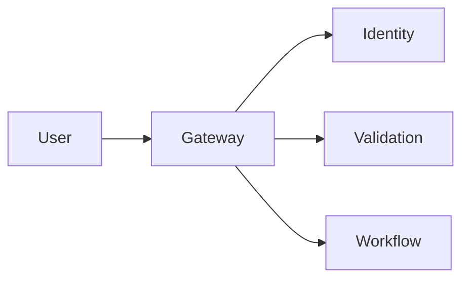

# Gateway (8080)

**Purpose:** The Gateway service is the single entry point for all external traffic into the CORTX platform. It handles routing, rate limiting, and policy enforcement.

**Responsibilities:**
- Reverse proxy to all platform services.
- Rate limiting (100 req/sec per tenant, burst 200).
- Request authentication (JWT validation).
- CORS handling.
- Request/response logging.
- Circuit breaker for downstream services.

**Authentication:** All requests to the Gateway must include a valid JWT in the `Authorization` header.

**Sample endpoints:**
- `GET /health`: Health check
- `POST /api/v1/rulepacks/execute`: Execute a RulePack
- `POST /api/v1/workflows/execute`: Execute a WorkflowPack
- `GET /api/v1/services`: Service discovery

**OpenAPI:** [openapi.yaml](./openapi.yaml)
