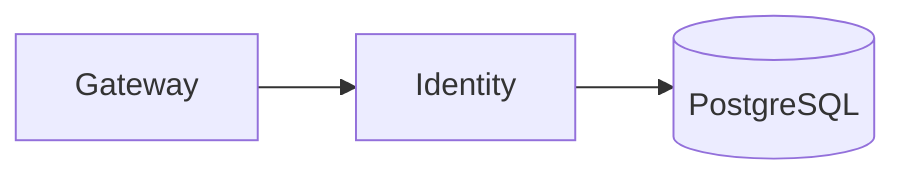

# Identity (8082)

**Purpose:** The Identity service manages authentication, authorization, and user roles for the CORTX platform.

**Responsibilities:**
- OAuth 2.0 / OpenID Connect support.
- Multi-factor authentication (MFA).
- JWT token issuance (15min access, 7day refresh).
- Role-Based Access Control (RBAC).
- Tenant onboarding automation.

**Authentication:** This service is internal to the platform and is called by the Gateway to validate JWTs and get user permissions.

**Sample endpoints:**
- `POST /oauth/token`: Issue a new JWT.
- `GET /userinfo`: Get information about the current user.
- `GET /roles`: Get a list of available roles.

**OpenAPI:** [openapi.yaml](./openapi.yaml)
