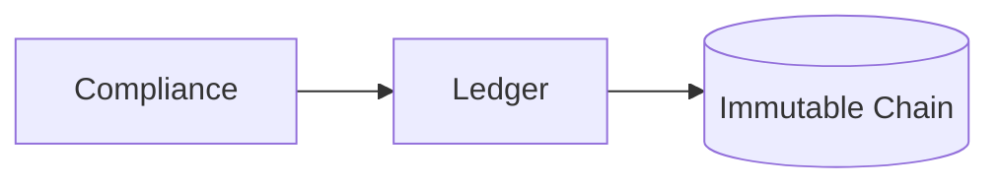

# Ledger (8136)

**Purpose:** The Ledger service provides a tamper-evident, append-only event log for compliance and audit purposes.

**Responsibilities:**
- Store events in a SHA-256 hash-chained ledger for immutability.
- Provide an append-only API for adding new events.
- Periodically verify the integrity of the ledger.
- Allow for the export of ledger data for external audits.

**Authentication:** This service is internal to the platform and is called by the Compliance service.

**Sample endpoints:**
- `POST /append`: Append a new event to the ledger.
- `GET /verify`: Verify the integrity of the ledger.
- `GET /events`: Get a list of events from the ledger.

**OpenAPI:** [openapi.yaml](./openapi.yaml)
