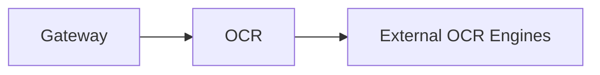

# OCR (8137)

**Purpose:** The OCR service extracts structured data and text from scanned documents and images.

**Responsibilities:**
- Support multiple OCR engines (Tesseract, Google DocAI).
- Extract text and map document zones to schema fields.
- Handle batch processing of large volumes of documents.
- Provide confidence scores for extracted data.
- Redact PII/PHI from the output if enabled.

**Authentication:** This service is internal to the platform and is called by the Gateway or other services.

**Sample endpoints:**
- `POST /extract`: Extract text and data from a document.
- `GET /results/{job_id}`: Get the results of an OCR job.

**OpenAPI:** [openapi.yaml](./openapi.yaml)
