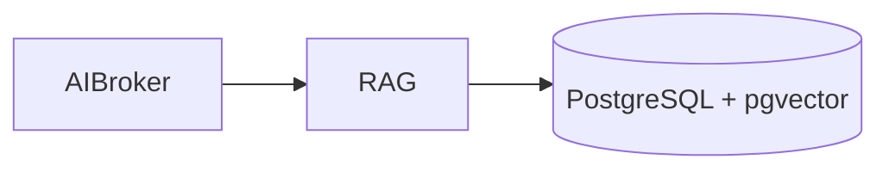

# RAG (8138)

**Purpose:** The RAG (Retrieval-Augmented Generation) service provides contextual, compliance-aware knowledge retrieval for AI and UI workflows.

**Responsibilities:**
- Implement a 4-level hierarchical knowledge store (Platform, Suite, Module, Entity).
- Index and embed documents for semantic search.
- Provide a scoped search API to retrieve relevant knowledge.
- Manage the RAG knowledge base through an admin UI.

**Authentication:** This service is internal to the platform and is called by the AI Broker and other services.

**Sample endpoints:**
- `POST /query`: Query the knowledge base.
- `POST /index`: Index a new document.
- `GET /docs`: Get a list of documents in the knowledge base.

**OpenAPI:** [openapi.yaml](./openapi.yaml)
