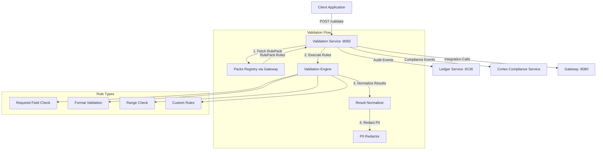

# Validation Service (Port 8083)

**Status:** ✅ Implemented | **Version:** 0.1.0

## Overview

The Validation service provides RulePack-based data validation for the CORTX platform. It executes validation rules against payloads, ensuring data quality, compliance, and format correctness before processing.

## Core Responsibilities

### RulePack Execution

- **Rule Fetching**: Retrieves RulePacks from CORTX Packs Registry
- **Rule Application**: Executes validation rules against input data
- **Result Normalization**: Standardizes validation outputs
- **PII Redaction**: Automatic redaction of sensitive data in results

### Validation Types

- **Required Field Validation**: Ensures mandatory fields are present
- **Format Validation**: Regex pattern matching for field values
- **Range Checks**: Numeric value range validation
- **Custom Rules**: Extensible rule execution framework

### Compliance Integration

- **Audit Logging**: All validations logged to Ledger service
- **Compliance Events**: Integration with CORTX Compliance service (Cortex)
- **Input Hashing**: SHA-256 hash of input for audit trail
- **PII Protection**: Redaction before storage/logging

## Architecture Diagram



## API Endpoints

### Health & Status

- `GET /healthz` - Liveness probe
- `GET /readyz` - Readiness probe
- `GET /livez` - Alias for liveness
- `GET /` - Service metadata

### Validation

- `POST /validate` - Validate payload using RulePack

  ```json
  {
    "rule_pack_id": "rp-001",
    "payload": {"id": "123", "data": {...}},
    "validation_type": "standard",
    "strict_mode": true,
    "metadata": {"source": "ui"}
  }
  ```

### Integration

- `GET /schemas` - Retrieve schemas from CORTX Schemas service

## Request/Response Models

### ValidationRequest

```json
{
  "rule_pack_id": "string",
  "payload": {},
  "validation_type": "standard",
  "strict_mode": true,
  "metadata": {}
}
```

### ValidationResponse

```json
{
  "result": {
    "valid": true,
    "errors": [],
    "warnings": [],
    "rule_results": {},
    "metadata": {}
  },
  "correlation_id": "req-123",
  "execution_time_ms": 45,
  "rule_pack_version": "1.0.0"
}
```

## Configuration

### Environment Variables

```bash
# Service
PORT=8083
LOG_LEVEL=INFO

# Gateway Integration
CORTX_GATEWAY_URL=http://localhost:8080

# Compliance Integration
CORTX_COMPLIANCE_URL=http://localhost:8135

# Authentication
REQUIRE_AUTH=false  # Set to "true" for production
```

## Usage Examples

### Basic Validation

```bash
curl -X POST http://localhost:8083/validate \
  -H "Content-Type: application/json" \
  -H "X-Tenant-ID: tenant-123" \
  -d '{
    "rule_pack_id": "rp-email-validation",
    "payload": {
      "email": "user@example.com",
      "age": 25
    },
    "strict_mode": true
  }'
```

## Documentation

- **OpenAPI Spec**: [openapi.yaml](./openapi.yaml)
- **Source Code**: `/services/validation/app/main.py`
- **RulePack Contracts**: CORTX RulePack SDK

## Support

For issues or questions:

- GitHub Issues: [sinergysolutionsllc/sinergysolutionsllc](https://github.com/sinergysolutionsllc/sinergysolutionsllc/issues)
- Internal Documentation: `/docs/services/validation/`
