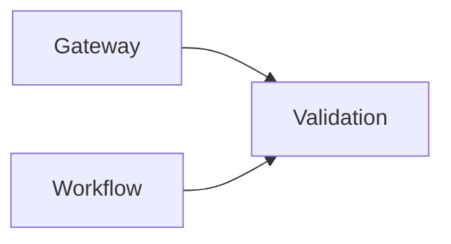

# Validation (8083)

**Purpose:** The Validation service is responsible for executing RulePacks and validating data against JSON schemas.

**Responsibilities:**
- Execute validation rules and compliance policies from RulePacks.
- Use safe operators to prevent code injection.
- Provide detailed error messages for validation failures.
- Support batch processing of large datasets.

**Authentication:** This service is internal to the platform and is called by the Gateway or other services.

**Sample endpoints:**
- `POST /validate`: Validate a data payload against a RulePack.

**OpenAPI:** [openapi.yaml](./openapi.yaml)
**JSON Schema Example:** `templates/MODULE.schema.template.json`
