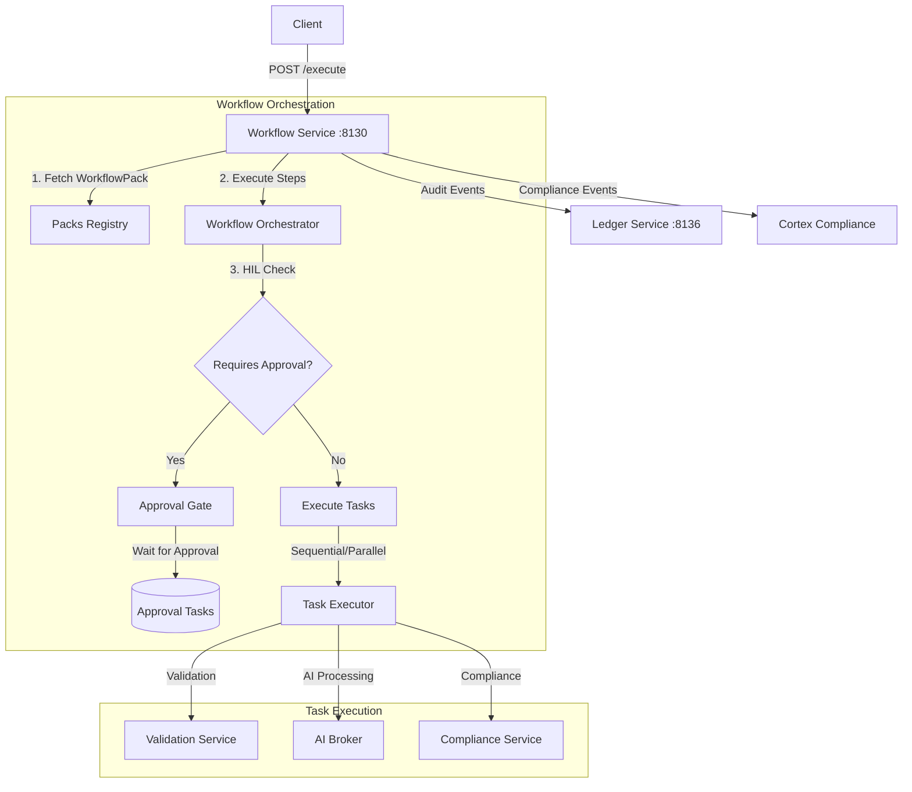

# Workflow Service (Port 8130)

**Status:** ✅ Implemented | **Version:** 0.1.0

## Overview

The Workflow service orchestrates multi-step business processes using WorkflowPacks. It manages sequential and parallel task execution, conditional branching, human-in-the-loop (HIL) approvals, and implements the Saga pattern for distributed transactions with automatic compensation.

## Core Responsibilities

### Workflow Orchestration

- **WorkflowPack Execution**: Execute multi-step business workflows
- **Sequential & Parallel Tasks**: Support both execution patterns
- **Conditional Branching**: Decision nodes based on data/results
- **State Management**: Track workflow execution state

### Human-in-the-Loop (HIL)

- **Approval Gates**: Pause workflows for human approval
- **Approval Tasks**: Create and manage approval requests
- **Auto-Detection**: Identify workflows requiring HIL based on type/data
- **Decision Recording**: Audit all HIL decisions

### Saga Pattern

- **Distributed Transactions**: Coordinate across multiple services
- **Compensation**: Automatic rollback on failures
- **Idempotency**: Safe retry of workflow steps
- **Event Sourcing**: Full audit trail of workflow events

## Architecture Diagram



## API Endpoints

### Health & Status

- `GET /healthz` - Liveness probe
- `GET /readyz` - Readiness probe
- `GET /livez` - Alias for liveness
- `GET /` - Service metadata

### Workflow Execution

- `POST /execute` - Execute WorkflowPack

  ```json
  {
    "workflow_pack_id": "wp-001",
    "workflow_type": "legal",
    "payload": {...},
    "metadata": {}
  }
  ```

- `GET /status/{workflow_id}` - Get workflow execution status
- `POST /approve/{approval_task_id}` - Approve pending workflow

### Integration

- `GET /workflow-status` - Get workflow service status via Gateway

## Request/Response Models

### WorkflowExecutionRequest

```json
{
  "workflow_pack_id": "wp-legal-review",
  "workflow_type": "legal",
  "payload": {
    "document_id": "doc-123",
    "action": "title_transfer"
  },
  "metadata": {
    "requester": "user-456"
  }
}
```

### WorkflowExecutionResponse

```json
{
  "status": "pending_approval",
  "workflow_id": "wf-abc123",
  "approval_task_id": "at-xyz789",
  "requires_human_approval": true,
  "correlation_id": "req-def456",
  "message": "Legal workflow requires HIL approval"
}
```

## Human-in-the-Loop (HIL) Approval

### Auto-Detection

HIL approval is required for workflows involving:

- **Legal**: Title transfers, lien releases, ownership changes
- **Financial**: Payments, refunds, transactions > threshold
- **Compliance**: Regulatory filings, audit modifications
- **Risk**: High-value operations, sensitive data access

### Approval Process

1. Workflow detects HIL requirement
2. Creates approval task with metadata
3. Returns `pending_approval` status with task ID
4. Human reviewer evaluates via UI/API
5. Reviewer submits decision (approve/reject/defer)
6. Workflow resumes or compensates

### Approval Task Structure

```json
{
  "approval_task_id": "at-xyz789",
  "workflow_id": "wf-abc123",
  "workflow_type": "legal",
  "payload": {...},
  "created_at": "2025-10-07T10:00:00Z",
  "status": "pending",
  "reviewer": null,
  "decision": null
}
```

## Saga Pattern Implementation

### Compensating Transactions

Each workflow step defines compensation logic:

```json
{
  "step": "transfer_funds",
  "action": "debit_account",
  "compensation": "credit_account",
  "idempotency_key": "txn-123"
}
```

### Failure Handling

On step failure:

1. Log failure event
2. Execute compensation steps in reverse order
3. Mark workflow as `failed` with rollback complete
4. Emit compliance events

## Configuration

### Environment Variables

```bash
# Service
PORT=8130
LOG_LEVEL=INFO

# Gateway Integration
CORTX_GATEWAY_URL=http://localhost:8080

# Compliance Integration
CORTX_COMPLIANCE_URL=http://localhost:8135

# Authentication
REQUIRE_AUTH=false  # Set to "true" for production
```

## Usage Examples

### Execute Workflow

```bash
curl -X POST http://localhost:8130/execute \
  -H "Content-Type: application/json" \
  -H "X-Tenant-ID: tenant-123" \
  -d '{
    "workflow_pack_id": "wp-title-transfer",
    "workflow_type": "legal",
    "payload": {
      "property_id": "prop-456",
      "new_owner": "buyer-789"
    }
  }'
```

Response:

```json
{
  "status": "pending_approval",
  "workflow_id": "wf-abc123",
  "approval_task_id": "at-xyz789",
  "requires_human_approval": true,
  "correlation_id": "req-def456",
  "message": "Title transfer requires legal approval"
}
```

### Approve Workflow

```bash
curl -X POST http://localhost:8130/approve/at-xyz789 \
  -H "Content-Type: application/json" \
  -H "X-User-ID: reviewer-001" \
  -d '{
    "decision": "approved",
    "notes": "Documents verified, proceed with transfer"
  }'
```

### Check Workflow Status

```bash
curl http://localhost:8130/status/wf-abc123 \
  -H "X-Tenant-ID: tenant-123"
```

## Performance

### Throughput

- **Simple Workflows**: ~100 executions/second
- **Complex Workflows**: ~20 executions/second
- **HIL Workflows**: Limited by human approval time

### Scalability

- Stateless orchestration (state in external store)
- Horizontal scaling via multiple instances
- Distributed task execution

## Documentation

- **OpenAPI Spec**: [openapi.yaml](./openapi.yaml)
- **Source Code**: `/services/workflow/app/main.py`
- **WorkflowPack Contracts**: CORTX WorkflowPack SDK

## Support

For issues or questions:

- GitHub Issues: [sinergysolutionsllc/sinergysolutionsllc](https://github.com/sinergysolutionsllc/sinergysolutionsllc/issues)
- Internal Documentation: `/docs/services/workflow/`
