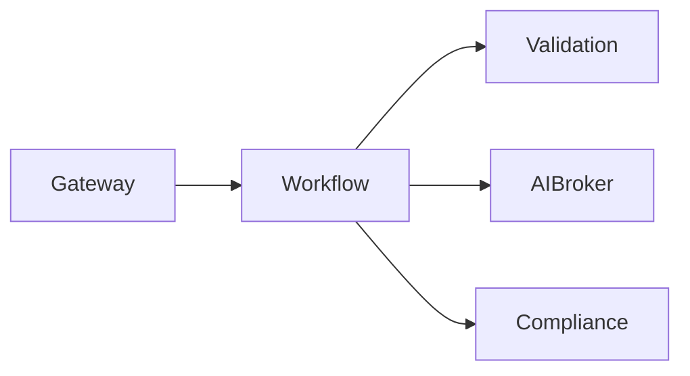

# Workflow (8130)

**Purpose:** The Workflow service orchestrates the execution of multi-step business processes defined in WorkflowPacks.

**Responsibilities:**
- Execute WorkflowPacks sequentially or in parallel.
- Handle conditional branching and decision nodes.
- Manage human-in-the-loop approval gates.
- Implement the Saga pattern for distributed transactions with automatic compensation on failures.

**Authentication:** This service is internal to the platform and is called by the Gateway.

**Sample endpoints:**
- `POST /execute`: Execute a WorkflowPack.
- `GET /status/{workflow_id}`: Get the status of a running workflow.

**OpenAPI:** [openapi.yaml](./openapi.yaml)
